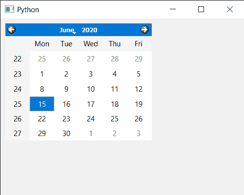

# PyQt5 QCalendarWidget–设置移动事件

> 原文:[https://www . geeksforgeeks . org/pyqt 5-qcalendarwidget-setting-move-event/](https://www.geeksforgeeks.org/pyqt5-qcalendarwidget-setting-move-event/)

在本文中，我们将看到如何实现 QCalendarWidget 的移动事件。这个事件处理程序可以在一个子类中重新实现，以接收在事件参数中传递的日历移动事件。当日历收到此事件时，它已经在新位置。

下面是日历类的代码

```
# QCalendarWidget Class
class Calendar(QCalendarWidget):

    # constructor
    def __init__(self, parent=None):
        super(Calendar, self).__init__(parent)
        self.setMouseTracking(True)

    # override the move event
    def moveEvent(self, event):
        print("Calendar Moved")

```

> 实施步骤:
> 1。创建一个继承 QCalendarWidget
> 2 的日历类。在日历类中覆盖移动事件，在事件中打印文本
> 3。创建主窗口类
> 4。在主窗口
> 5 内创建一个日历对象。为日历设置各种属性

下面是实现

```
# importing libraries
from PyQt5.QtWidgets import * 
from PyQt5 import QtCore, QtGui
from PyQt5.QtGui import * 
from PyQt5.QtCore import * 
import sys

# QCalendarWidget Class
class Calendar(QCalendarWidget):

    # constructor
    def __init__(self, parent = None):
        super(Calendar, self).__init__(parent)
        self.setMouseTracking(True)

    # override the move event
    def moveEvent(self, event):
        print("Calendar Moved")

class Window(QMainWindow):

    def __init__(self):
        super().__init__()

        # setting title
        self.setWindowTitle("Python ")

        # setting geometry
        self.setGeometry(100, 100, 500, 400)

        # calling method
        self.UiComponents()

        # showing all the widgets
        self.show()

    # method for components
    def UiComponents(self):

        # creating a QCalendarWidget object
        # as Calendar class inherits QCalendarWidget
        self.calendar = Calendar(self)

        # setting cursor
        self.calendar.setCursor(Qt.PointingHandCursor)

        # setting size of the calendar
        self.calendar.resize(300, 240)

        # move the calendar
        self.calendar.move(10, 10)

# create pyqt5 app
App = QApplication(sys.argv)

# create the instance of our Window
window = Window()

# start the app
sys.exit(App.exec())
```

**输出:**

```
Calendar Move
```

