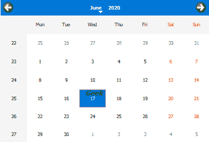

# PyQt5 QCalendarWidget–将文本设置为所选日期

> 原文:[https://www . geesforgeks . org/pyqt5-qcalendarwidget-设置-文本到选定日期/](https://www.geeksforgeeks.org/pyqt5-qcalendarwidget-setting-text-to-the-selected-date/)

在本文中，我们将看到如何将文本设置为 QCalendarWidget 的选定日期。为了将文本添加到所选日期，我们必须使用`paintCell`方法，它是虚拟保护方法，并且可以通过覆盖该方法来使用，因为该方法是在 paintEvent()中调用的。下面是文本的外观



> 实施步骤:
> 1。创建继承 QCalendarWidget
> 2 的日历类。在日历类内覆盖绘画单元方法
> 3。创建主窗口
> 4。在主窗口中添加日历对象

下面是日历类代码

```
# QCalendarWidget Class
class Calendar(QCalendarWidget):

    def paintCell(self, painter, rect, date):
        super(Calendar, self).paintCell(painter, rect, date)

        # checking if date is selected date
        if date == self.selectedDate():

            # saving the painter
            painter.save()

            # creating a QFont object
            font = QFont()

            # setting pixel size of the font
            font.setPixelSize(11)

            # making font bold
            font.setBold(True)

            # making font italic
            font.setItalic(True)

            # setting font to the painter
            painter.setFont(font)

            # drawing text
            painter.drawText(
                rect.topLeft() + QPoint(10, 10),
                "{}".format("Geek"),
            )

            # restoring the painter
            painter.restore()

```

下面是实现

```
# importing libraries
from PyQt5.QtWidgets import * 
from PyQt5 import QtCore, QtGui
from PyQt5.QtGui import * 
from PyQt5.QtCore import * 
import sys

# QCalendarWidget Class
class Calendar(QCalendarWidget):

    def paintCell(self, painter, rect, date):
        super(Calendar, self).paintCell(painter, rect, date)

        # checking if date is selected date
        if date == self.selectedDate():

            # saving the painter
            painter.save()

            # creating a QFont object
            font = QFont()

            # setting pixel size of the font
            font.setPixelSize(11)

            # making font bold
            font.setBold(True)

            # making font italic
            font.setItalic(True)

            # setting font to the painter
            painter.setFont(font)

            # drawing text
            painter.drawText(
                rect.topLeft() + QPoint(10, 10),
                "{}".format("Geek"),
            )

            # restoring the painter
            painter.restore()

class Window(QMainWindow):

    def __init__(self):
        super().__init__()

        # setting title
        self.setWindowTitle("Python ")

        # setting geometry
        self.setGeometry(100, 100, 500, 400)

        # calling method
        self.UiComponents()

        # showing all the widgets
        self.show()

    # method for components
    def UiComponents(self):

        # creating a QCalendarWidget object
        # as Calendar class inherits QCalendarWidget
        self.calendar = Calendar(self)

        # setting cursor
        self.calendar.setCursor(Qt.PointingHandCursor)

        # setting size of the calendar
        self.calendar.resize(350, 240)

        # setting font to the calendar
        self.calendar.setFont(QFont('Times', 5))

        # move the calendar
        self.calendar.move(10, 10)

# create pyqt5 app
App = QApplication(sys.argv)

# create the instance of our Window
window = Window()

# start the app
sys.exit(App.exec())
```

**输出:**

<video class="wp-video-shortcode" id="video-434803-1" width="640" height="512" preload="metadata" controls=""><source type="video/mp4" src="https://media.geeksforgeeks.org/wp-content/uploads/20200617001116/Python-2020-06-17-00-10-45.mp4?_=1">[https://media.geeksforgeeks.org/wp-content/uploads/20200617001116/Python-2020-06-17-00-10-45.mp4](https://media.geeksforgeeks.org/wp-content/uploads/20200617001116/Python-2020-06-17-00-10-45.mp4)</video>