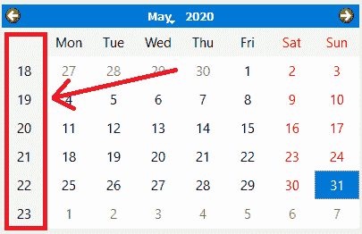
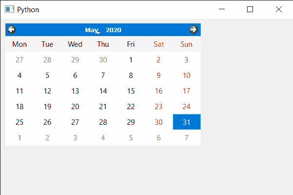

# PyQt5 QCalendarWidget–设置垂直标题格式

> 原文:[https://www . geeksforgeeks . org/pyqt 5-qcalendarwidget-设置-垂直-标题-格式/](https://www.geeksforgeeks.org/pyqt5-qcalendarwidget-setting-vertical-header-format/)

在本文中，我们将看到如何设置 QCalendarWidget 的垂直标题格式。垂直标题是 QCalendarWidget 中告诉 ISO 周数的部分，下面是垂直标题的外观表示。



垂直标题基本上有两种格式，一种是等周数字，它的值是 1，它是默认的，第二种是无垂直标题，它的值是 0，它不显示垂直标题。

> 为此，我们将对 QCalendarWidget 对象使用 setVerticalHeaderFormat 方法。
> **语法:**calendar . setverticalheaderformat(格式)
> **参数:**它以垂直标题格式作为参数
> **返回:**它不返回任何值

下面是实现

## 蟒蛇 3

```
# importing libraries
from PyQt5.QtWidgets import *
from PyQt5 import QtCore, QtGui
from PyQt5.QtGui import *
from PyQt5.QtCore import *
import sys

class Window(QMainWindow):

    def __init__(self):
        super().__init__()

        # setting title
        self.setWindowTitle("Python ")

        # setting geometry
        self.setGeometry(100, 100, 600, 400)

        # calling method
        self.UiComponents()

        # showing all the widgets
        self.show()

    # method for components
    def UiComponents(self):

        # creating a QCalendarWidget object
        calendar = QCalendarWidget(self)

        # setting geometry to the calendar
        calendar.setGeometry(10, 10, 400, 250)

        # setting vertical header format
        calendar.setVerticalHeaderFormat(QCalendarWidget.NoVerticalHeader)

# create pyqt5 app
App = QApplication(sys.argv)

# create the instance of our Window
window = Window()

# start the app
sys.exit(App.exec())
```

**输出:**

