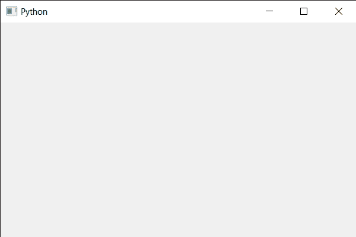

# PyQt5 QCalendarWidget–设置可见属性状态

> 原文:[https://www . geeksforgeeks . org/pyqt 5-qcalendarwidget-setting-visible-property-status/](https://www.geeksforgeeks.org/pyqt5-qcalendarwidget-setting-visible-property-status/)

在本文中，我们将看到如何使 QCalendarWidget 可见和不可见，通过使可见属性为 False，我们可以使其不可见。我们可以借助`show`方法使其可见，但该方法不会使其不可见，因此我们使用了可同时实现这两种功能的可见属性。

> 为此，我们将对 QCalendarWidget 对象使用`setVisible`方法。
> 
> **语法:** calendar.setVisible(False)
> 
> **自变量:**它以布尔为自变量
> 
> **返回:**返回无

下面是实现

```py
# importing libraries
from PyQt5.QtWidgets import * 
from PyQt5 import QtCore, QtGui
from PyQt5.QtGui import * 
from PyQt5.QtCore import * 
import sys

class Window(QMainWindow):

    def __init__(self):
        super().__init__()

        # setting title
        self.setWindowTitle("Python ")

        # setting geometry
        self.setGeometry(100, 100, 600, 400)

        # calling method
        self.UiComponents()

        # showing all the widgets
        self.show()

    # method for components
    def UiComponents(self):

        # creating a QCalendarWidget object
        calender = QCalendarWidget(self)

        # setting geometry to the calender
        calender.setGeometry(10, 10, 400, 250)

        # setting visible property
        calender.setVisible(False)

# create pyqt5 app
App = QApplication(sys.argv)

# create the instance of our Window
window = Window()

# start the app
sys.exit(App.exec())
```

**输出:**
