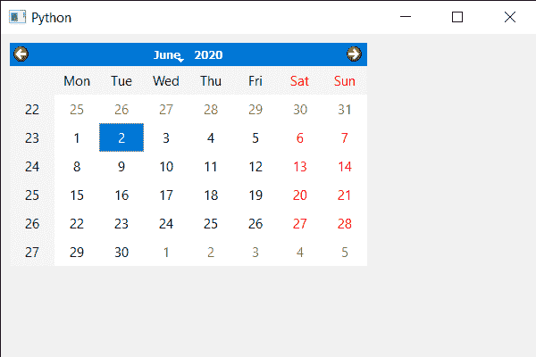

# PyQt5 QCalendarWidget–设置窗口修改属性

> 原文:[https://www . geeksforgeeks . org/pyqt 5-qcalendarwidget-设置-窗口-修改-属性/](https://www.geeksforgeeks.org/pyqt5-qcalendarwidget-setting-window-modified-property/)

在本文中，我们将看到如何设置 QCalendarWidget 的窗口修改属性。窗口修改属性保存窗口中显示的日历是否有未保存的更改，默认情况下，该属性为假，尽管我们可以更改它。

**注意:**如果一个 QCalendarWidget 被设置为已修改，那么它的所有祖先也会被设置为已修改。

> 为此，我们将对 QCalendarWidget 对象使用`setWindowModified`方法。
> 
> **语法:**日历. setWindowModified(True)
> 
> **自变量:**它以布尔为自变量
> 
> **返回:**返回无

下面是实现

```py
# importing libraries
from PyQt5.QtWidgets import * 
from PyQt5 import QtCore, QtGui
from PyQt5.QtGui import * 
from PyQt5.QtCore import * 
import sys

class Window(QMainWindow):

    def __init__(self):
        super().__init__()

        # setting title
        self.setWindowTitle("Python ")

        # setting geometry
        self.setGeometry(100, 100, 600, 400)

        # calling method
        self.UiComponents()

        # showing all the widgets
        self.show()

    # method for components
    def UiComponents(self):

        # creating a QCalendarWidget object
        calender = QCalendarWidget(self)

        # setting geometry to the calender
        calender.setGeometry(10, 10, 400, 250)

        # setting window modified property
        calender.setWindowModified(True)

# create pyqt5 app
App = QApplication(sys.argv)

# create the instance of our Window
window = Window()

# start the app
sys.exit(App.exec())
```

**输出:**
