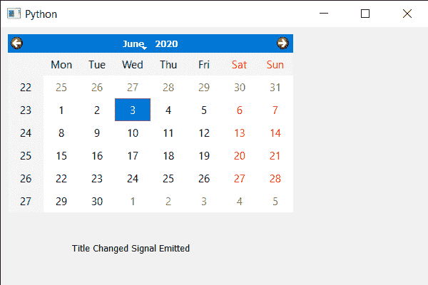

# PyQt5 QCalendarWidget–标题更改信号

> 原文:[https://www . geesforgeks . org/pyqt 5-qcalendarwidget-title-changed-signal/](https://www.geeksforgeeks.org/pyqt5-qcalendarwidget-title-changed-signal/)

在本文中，我们将看到如何从 QCalendarWidget 获取标题更改信号。当日历的标题(即标题)改变时，会发出标题改变信号。设置标题也会发出同样的信号。

> 为此，我们将使用带有 QCalendarWidget 对象的 windowTitleChanged 方法。
> **语法:**calendar . window Title Changed . connect(lambda:print(“Title Changed”))
> **参数:**不需要参数
> **执行的动作:**只要发出信号就会打印消息

下面是实现

## 蟒蛇 3

```py
# importing libraries
from PyQt5.QtWidgets import *
from PyQt5 import QtCore, QtGui
from PyQt5.QtGui import *
from PyQt5.QtCore import *
import sys

class Window(QMainWindow):

    def __init__(self):
        super().__init__()

        # setting title
        self.setWindowTitle("Python ")

        # setting geometry
        self.setGeometry(100, 100, 600, 400)

        # calling method
        self.UiComponents()

        # showing all the widgets
        self.show()

    # method for components
    def UiComponents(self):

        # creating a QCalendarWidget object
        calendar = QCalendarWidget(self)

        # setting geometry to the calendar
        calendar.setGeometry(10, 10, 400, 250)

        # creating a label
        label = QLabel(self)

        # setting geometry to the label
        label.setGeometry(100, 280, 250, 60)

        # making label multi line
        label.setWordWrap(True)

        # text
        text = "Title Changed Signal Emitted"

        # getting the title changed signal and
        # when receives the signal printing the message
        calendar.windowTitleChanged.connect(lambda: label.setText(text))

        # setting caption to the calendar
        calendar.setWindowTitle("Title")

# create pyqt5 app
App = QApplication(sys.argv)

# create the instance of our Window
window = Window()

# start the app
sys.exit(App.exec())
```

**输出:**

