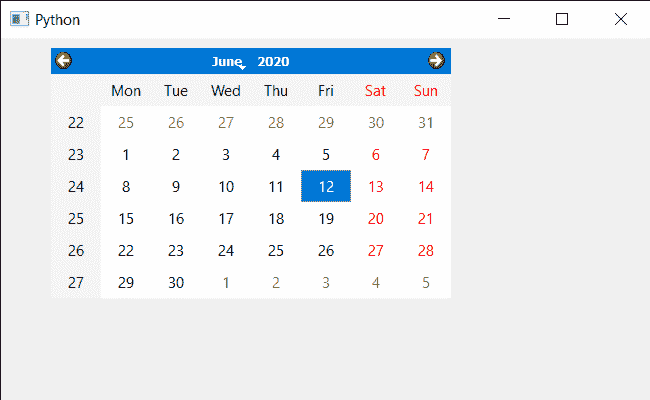

# PyQt5 QCalendarWidget–取消设置方向属性

> 原文:[https://www . geeksforgeeks . org/pyqt 5-qcalendarwidget-unset-direction-property/](https://www.geeksforgeeks.org/pyqt5-qcalendarwidget-unsetting-direction-property/)

在本文中，我们将看到如何取消设置 QCalendarWidget 的方向属性。日历中有三种可用的方向，第一种是默认的从左到右，第二种是从右到左的布局，这是某些语言所必需的，尤其是阿拉伯语和希伯来语。第三是 LayoutDirectionAuto 服务于两个目的。当与其他对象结合使用时，它将意味着使用父小部件或 QApplication 上设置的布局方向。取消设置意味着恢复到日历的默认方向属性。

> 为此，我们将对 QCalendarWidget 对象使用`unsetLayoutDirection`方法。
> 
> **语法:**calendar . unsetlayoutdirection()
> 
> **论证:**不需要论证
> 
> **返回:**不返回

下面是实现

```py
# importing libraries
from PyQt5.QtWidgets import * 
from PyQt5 import QtCore, QtGui
from PyQt5.QtGui import * 
from PyQt5.QtCore import * 
import sys

class Window(QMainWindow):

    def __init__(self):
        super().__init__()

        # setting title
        self.setWindowTitle("Python ")

        # setting geometry
        self.setGeometry(100, 100, 650, 400)

        # calling method
        self.UiComponents()

        # showing all the widgets
        self.show()

    # method for components
    def UiComponents(self):

        # creating a QCalendarWidget object
        self.calendar = QCalendarWidget(self)

        # setting geometry to the calender
        self.calendar.setGeometry(50, 10, 400, 250)

        # setting cursor
        self.calendar.setCursor(Qt.PointingHandCursor)

        # setting direction
        self.calendar.setLayoutDirection(Qt.RightToLeft)

        # un setting the direction
        self.calendar.unsetLayoutDirection()

# create pyqt5 app
App = QApplication(sys.argv)

# create the instance of our Window
window = Window()

# start the app
sys.exit(App.exec())
```

**输出:**
