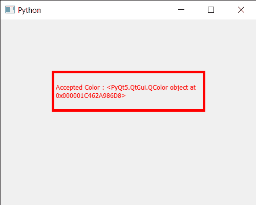

# PyQt5 qcolor dialog–接受颜色

> 原文:[https://www . geeksforgeeks . org/pyqt5-qcolor dialog-accepting-the-color/](https://www.geeksforgeeks.org/pyqt5-qcolordialog-accepting-the-color/)

在本文中，我们将看到如何接受 QColorDialog 小部件。接受隐藏模式对话框并将结果代码设置为接受，这与用户按“确定”按钮时相同。

这个方法调用完成的信号

为了做到这一点，我们对 QColorDialog 对象使用`accept`方法

> **语法:**对话框.接受()
> 
> **论证:**不需要论证
> 
> **返回:**返回无

下面是实现

```
# importing libraries
from PyQt5.QtWidgets import * 
from PyQt5 import QtCore, QtGui
from PyQt5.QtGui import * 
from PyQt5.QtCore import * 
import sys

class Window(QMainWindow):

    def __init__(self):
        super().__init__()

        # setting title
        self.setWindowTitle("Python ")

        # setting geometry
        self.setGeometry(100, 100, 500, 400)

        # calling method
        self.UiComponents()

        # showing all the widgets
        self.show()

    # method for components
    def UiComponents(self):

        # creating a QColorDialog object
        dialog = QColorDialog(self)

        # setting current color to the dialog
        dialog.setCurrentColor(Qt.red)

        # accepting the color
        dialog.accept()

        # executing the dialog
        # dialog.exec_()

        # creating label
        label = QLabel("GeeksforGeeks", self)

        # setting geometry to the label
        label.setGeometry(100, 100, 300, 80)

        # making label multi line
        label.setWordWrap(True)

        # setting stylesheet of the label
        label.setStyleSheet("QLabel"
                            "{"
                            "border : 5px solid black;"
                            "}")

        # getting the selected color
        color = dialog.selectedColor()

        # setting graphic effect to the label
        graphic = QGraphicsColorizeEffect(self)

        # setting color to the graphic
        graphic.setColor(color)

        # setting graphic to the label
        label.setGraphicsEffect(graphic)

        # setting text to the label
        label.setText("Accepted Color : " + str(color))

# create pyqt5 app
App = QApplication(sys.argv)

# create the instance of our Window
window = Window()

# start the app
sys.exit(App.exec())
```

```
# Write Python3 code here
```

**输出:**


**注意:**在这个实现中，我们没有执行颜色对话框，因为我们设置了当前颜色，并以编程方式接受该颜色将使其成为选定的颜色，而不是默认的白色