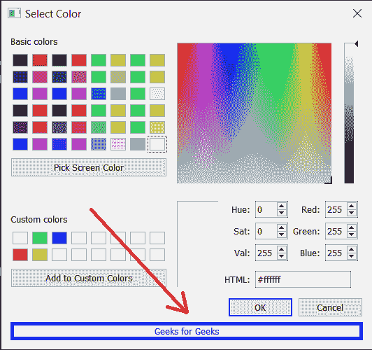
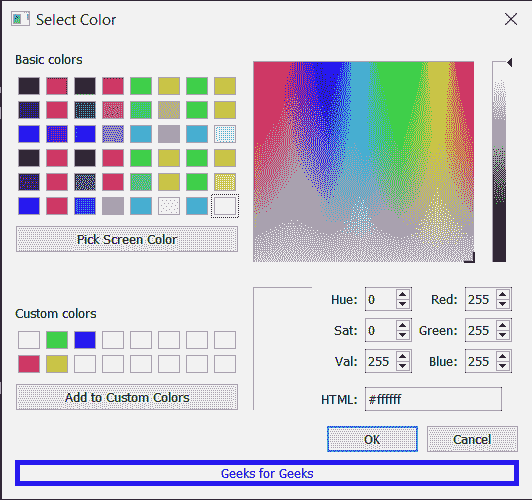

# PyQt5 qcolor dialog–向其中添加额外的小部件

> 原文:[https://www . geeksforgeeks . org/pyqt5-qcolor dialog-add-extra-widget-to-it/](https://www.geeksforgeeks.org/pyqt5-qcolordialog-adding-extra-widget-to-it/)

在本文中，我们将看到如何向 QColorDialog 添加额外的小部件。额外的小部件就像添加到颜色对话框的额外功能，它可以是标签按钮或任何其他东西，下面是额外的小部件看起来像



> 实施步骤:
> 1。创建主窗口类
> 2。在主窗口类内创建一个 QColorDialog 对象
> 3。向颜色对话框
> 4 添加属性。创建一个标签并设置其属性
> 5。将此标签添加到对话框对象的布局中
> 6。执行对话框
> 7。删除主窗口类

下面是实现

## 蟒蛇 3

```
# importing libraries
from PyQt5.QtWidgets import *
from PyQt5 import QtCore, QtGui
from PyQt5.QtGui import *
from PyQt5.QtCore import *
import sys

class Window(QMainWindow):

    def __init__(self):
        super().__init__()

        # setting title
        self.setWindowTitle("Python ")

        # setting geometry
        self.setGeometry(100, 100, 500, 400)

        # calling method
        self.UiComponents()

        # showing all the widgets
        self.show()

    # method for components
    def UiComponents(self):

        # creating a QColorDialog object
        dialog = QColorDialog(self)

        # setting custom colors
        dialog.setCustomColor(1, Qt.red)
        dialog.setCustomColor(2, Qt.green)
        dialog.setCustomColor(3, Qt.yellow)
        dialog.setCustomColor(4, Qt.blue)

        # executing the dialog
        # dialog.exec_()

        # creating label
        label = QLabel("Geeks for Geeks", self)

        label.setAlignment(Qt.AlignCenter)

        # making label multi line
        label.setWordWrap(True)

        # setting stylesheet of the label
        label.setStyleSheet("QLabel"
                            "{"
                            "border : 5px solid black;"
                            "}")

        # getting the custom color
        color = dialog.customColor(4)

        # setting graphic effect to the label
        graphic = QGraphicsColorizeEffect(self)

        # setting color to the graphic
        graphic.setColor(color)

        # setting graphic to the label
        label.setGraphicsEffect(graphic)

        layout = dialog.layout()

        layout.addWidget(label)

        dialog.setLayout(layout)

        # getting dialog layout
        # value = dialog.layout()

        dialog.exec_()

        # setting text to the label
        # label.setText("Layout : " + str(value))

        self.deleteLater()

# create pyqt5 app
App = QApplication(sys.argv)

# create the instance of our Window
window = Window()

# start the app
sys.exit(App.exec())
```

**输出:**

