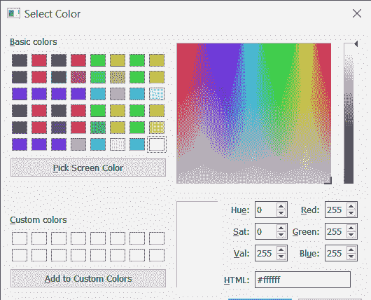
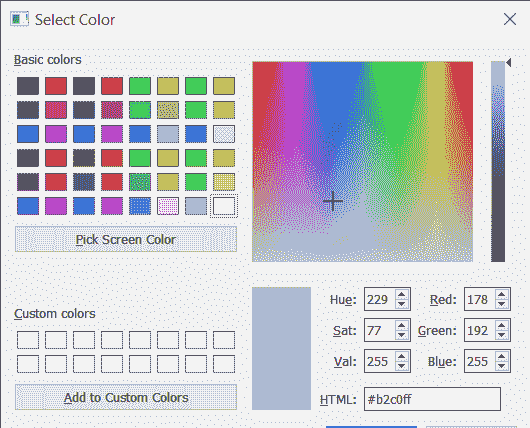
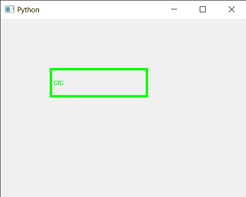

# PyQt5 qcolor dialog–如何执行？

> 原文:[https://www . geeksforgeeks . org/pyqt 5-qcolor dialog-如何执行-it/](https://www.geeksforgeeks.org/pyqt5-qcolordialog-how-to-execute-it/)

在本文中，我们将看到如何执行 QColorDialog 小部件，执行意味着打开它。打开 QColorDialog 的方式基本上有两种一种是调用`getColor`方法，这是一种静态的方式，每次都会打开 QColorDialog 的新实例，这种方式对于快速使用有用但不可取。第二种方法是通过执行它，看看`QColorDialog`是什么样子。



为了做到这一点，我们对 QColorDialog 对象使用`exec_()`方法

> **语法:** dialog.exec_()
> 
> **论证:**不需要论证
> 
> **执行的操作:**打开 QColorDialog 小部件

下面是实现

```py
# importing libraries
from PyQt5.QtWidgets import * 
from PyQt5 import QtCore, QtGui
from PyQt5.QtGui import * 
from PyQt5.QtCore import * 
import sys

class Window(QMainWindow):

    def __init__(self):
        super().__init__()

        # setting title
        self.setWindowTitle("Python ")

        # setting geometry
        self.setGeometry(100, 100, 500, 400)

        # calling method
        self.UiComponents()

        # showing all the widgets
        self.show()

    # method for components
    def UiComponents(self):

        # creating a QColorDialog object
        dialog = QColorDialog(self)

        # executing the dialog
        dialog.exec_()

        # creating label to display the color
        label = QLabel("GfG", self)

        # setting geometry to the label
        label.setGeometry(100, 100, 200, 60)

        # making label multi line
        label.setWordWrap(True)

        # setting stylesheet of the label
        label.setStyleSheet("QLabel"
                            "{"
                            "border : 5px solid black;"
                            "}")

        color = Qt.green

        # setting graphic effect to the label
        graphic = QGraphicsColorizeEffect(self)

        # setting color to the graphic
        graphic.setColor(color)

        # setting graphic to the label
        label.setGraphicsEffect(graphic)

# create pyqt5 app
App = QApplication(sys.argv)

# create the instance of our Window
window = Window()

# start the app
sys.exit(App.exec())
```

**输出:**

