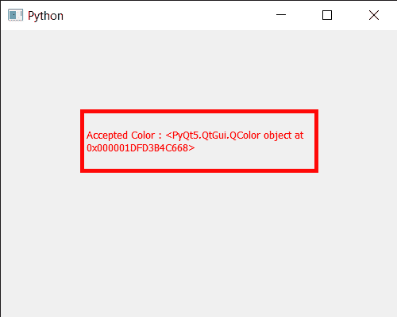

# PyQt5 qcolor dialog–完成上色

> 原文:[https://www . geeksforgeeks . org/pyqt 5-qcolor dialog-making-color-done/](https://www.geeksforgeeks.org/pyqt5-qcolordialog-making-color-done/)

在本文中，我们将看到如何在 QColorDialog 小部件中完成颜色。这将关闭对话框并将其结果代码设置为 r。将发出完成的信号，如果 r 为`QDialog::Accepted`或`QDialog::Rejected`，则接受或拒绝的信号也将分别发出。

为了做到这一点，我们对 QColorDialog 对象使用`done`方法

> **语法:**对话框。完成(1)
> 
> **参数:**以整数为参数，如果通过 0，则拒绝颜色，如果通过 1，则接受颜色
> 
> **返回:**返回无

下面是实现

```py
# importing libraries
from PyQt5.QtWidgets import * 
from PyQt5 import QtCore, QtGui
from PyQt5.QtGui import * 
from PyQt5.QtCore import * 
import sys

class Window(QMainWindow):

    def __init__(self):
        super().__init__()

        # setting title
        self.setWindowTitle("Python ")

        # setting geometry
        self.setGeometry(100, 100, 500, 400)

        # calling method
        self.UiComponents()

        # showing all the widgets
        self.show()

    # method for components
    def UiComponents(self):

        # creating a QColorDialog object
        dialog = QColorDialog(self)

        # setting current color to the dialog
        dialog.setCurrentColor(Qt.red)

        # making color done
        dialog.done(1)

        # executing the dialog
        # dialog.exec_()

        # creating label
        label = QLabel("GeeksforGeeks", self)

        # setting geometry to the label
        label.setGeometry(100, 100, 300, 80)

        # making label multi line
        label.setWordWrap(True)

        # setting stylesheet of the label
        label.setStyleSheet("QLabel"
                            "{"
                            "border : 5px solid black;"
                            "}")

        # getting the selected color
        color = dialog.selectedColor()

        # setting graphic effect to the label
        graphic = QGraphicsColorizeEffect(self)

        # setting color to the graphic
        graphic.setColor(color)

        # setting graphic to the label
        label.setGraphicsEffect(graphic)

        # setting text to the label
        label.setText("Accepted Color : " + str(color))

# create pyqt5 app
App = QApplication(sys.argv)

# create the instance of our Window
window = Window()

# start the app
sys.exit(App.exec())
```

**输出:**


在这个实现中，我们没有执行颜色对话框，因为我们设置了当前的颜色，并以编程方式接受颜色，将使其成为选定的颜色，而不是默认的白色，这是通过调用 done 方法实现的