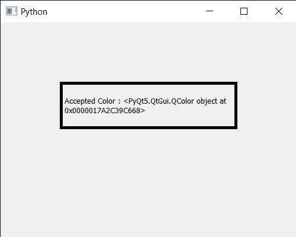

# PyQt5 qcolor dialog–拒绝信号

> 原文:[https://www . geesforgeks . org/pyqt 5-qcolor dialog-rejected-signal/](https://www.geeksforgeeks.org/pyqt5-qcolordialog-rejected-signal/)

在本文中，我们将看到如何获得 QColorDialog 小部件的拒绝信号。当对话被用户或通过使用 QDialog::Rejected 参数调用`reject()`或`done()`拒绝时，会发出此信号。

**注意:**用 hide()或 setVisible()隐藏对话框时不发出此信号(false)。这包括在对话框可见时将其删除。

为了做到这一点，我们对 QColorDialog 对象使用`rejected`方法

> **语法:**对话框.拒绝.连接(λ:打印(“拒绝信号”)
> 
> **自变量:**以方法为自变量
> 
> **执行的操作:**当发出拒绝信号时，它将调用传递的方法

下面是实现

```py
# importing libraries
from PyQt5.QtWidgets import * 
from PyQt5 import QtCore, QtGui
from PyQt5.QtGui import * 
from PyQt5.QtCore import * 
import sys

class Window(QMainWindow):

    def __init__(self):
        super().__init__()

        # setting title
        self.setWindowTitle("Python ")

        # setting geometry
        self.setGeometry(100, 100, 500, 400)

        # calling method
        self.UiComponents()

        # showing all the widgets
        self.show()

    # method for components
    def UiComponents(self):

        # creating a QColorDialog object
        dialog = QColorDialog(self)

        # setting current color to the dialog
        dialog.setCurrentColor(Qt.red)

        # getting rejected signal
        dialog.rejected.connect(lambda: print("Rejected  Signal"))

        # making color done
        # rejecting the color
        dialog.done(0)

        # executing the dialog
        dialog.exec_()

        # creating label
        label = QLabel("GeeksforGeeks", self)

        # setting geometry to the label
        label.setGeometry(100, 100, 300, 80)

        # making label multi line
        label.setWordWrap(True)

        # setting stylesheet of the label
        label.setStyleSheet("QLabel"
                            "{"
                            "border : 5px solid black;"
                            "}")

        # getting the selected color
        color = dialog.selectedColor()

        # setting graphic effect to the label
        graphic = QGraphicsColorizeEffect(self)

        # setting color to the graphic
        graphic.setColor(color)

        # setting graphic to the label
        label.setGraphicsEffect(graphic)

        # setting text to the label
        label.setText("Accepted Color : " + str(color))

# create pyqt5 app
App = QApplication(sys.argv)

# create the instance of our Window
window = Window()

# start the app
sys.exit(App.exec())
```

**输出:**

```py
Rejected  Signal
Rejected  Signal

```

<video class="wp-video-shortcode" id="video-436545-1" width="640" height="516" preload="metadata" controls=""><source type="video/mp4" src="https://media.geeksforgeeks.org/wp-content/uploads/20200620032338/Select-Color-2020-06-20-03-23-17.mp4?_=1">[https://media.geeksforgeeks.org/wp-content/uploads/20200620032338/Select-Color-2020-06-20-03-23-17.mp4](https://media.geeksforgeeks.org/wp-content/uploads/20200620032338/Select-Color-2020-06-20-03-23-17.mp4)</video>

