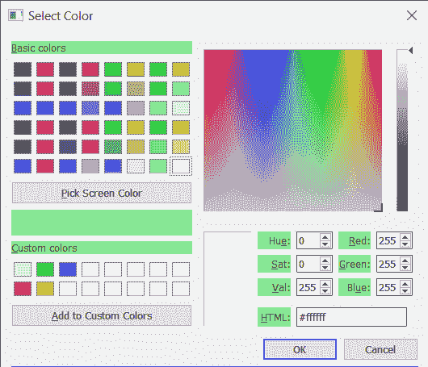

# PyQt5 qcolor dialog–设置子标签的背景颜色

> 原文:[https://www . geeksforgeeks . org/pyqt5-qcolor dialog-setting-background-color-to-child-label/](https://www.geeksforgeeks.org/pyqt5-qcolordialog-setting-background-color-to-the-child-label/)

在本文中，我们将看到如何为 QColorDialog 的标签(即其子标签)设置背景颜色。QColorDialog 是 PyQt5 中用于选择和创建颜色的弹出类型小部件。颜色对话框是一个巨大的小部件，由许多子小部件组成，因此很难为颜色对话框设置样式表，因为它是一个复杂的小部件，下面是 QColorDialog 小部件标签的背景颜色



为了做到这一点，我们必须借助`setStyleSheet`方法将样式表设置为 QColorDialog 对象，下面是样式表代码

```py
QColorDialog QLabel
{
background-color : lightgreen;
}

```

下面是实现

```py
# importing libraries
from PyQt5.QtWidgets import * 
from PyQt5 import QtCore, QtGui
from PyQt5.QtGui import * 
from PyQt5.QtCore import * 
import sys

class Window(QMainWindow):

    def __init__(self):
        super().__init__()

        # setting title
        self.setWindowTitle("Python ")

        # setting geometry
        self.setGeometry(100, 100, 500, 400)

        # calling method
        self.UiComponents()

        # showing all the widgets
        self.show()

    # method for components
    def UiComponents(self):

        # creating a QColorDialog object
        dialog = QColorDialog(self)

        # setting custom colors
        dialog.setCustomColor(1, Qt.red)
        dialog.setCustomColor(2, Qt.green)
        dialog.setCustomColor(3, Qt.yellow)
        dialog.setCustomColor(4, Qt.blue)

        # creating label
        label = QLabel("Geeks for Geeks", self)

        label.setAlignment(Qt.AlignCenter)

        # making label multi line
        label.setWordWrap(True)

        # setting stylesheet of the label
        label.setStyleSheet("QLabel"
                            "{"
                            "border : 5px solid black;"
                            "}")

        # getting the custom color
        color = dialog.customColor(4)

        # setting graphic effect to the label
        graphic = QGraphicsColorizeEffect(self)

        # setting color to the graphic
        graphic.setColor(color)

        # setting graphic to the label
        label.setGraphicsEffect(graphic)

        # adding label to the color dialog
        layout = dialog.layout()
        layout.addWidget(label)
        dialog.setLayout(layout)

        # setting style sheet to the color dialog's label
        # adding background color
        dialog.setStyleSheet("QColorDialog QLabel"
                             "{"
                             "background-color : lightgreen;"
                             "}")

        print(dialog.children())

        # executing the color dialog
        dialog.exec_()

        # deleting the main window
        self.deleteLater()

# create pyqt5 app
App = QApplication(sys.argv)

# create the instance of our Window
window = Window()

# start the app
sys.exit(App.exec())
```

**输出:**

<video class="wp-video-shortcode" id="video-438246-1" width="640" height="552" preload="metadata" controls=""><source type="video/mp4" src="https://media.geeksforgeeks.org/wp-content/uploads/20200624031548/Select-Color-2020-06-24-03-15-23.mp4?_=1">[https://media.geeksforgeeks.org/wp-content/uploads/20200624031548/Select-Color-2020-06-24-03-15-23.mp4](https://media.geeksforgeeks.org/wp-content/uploads/20200624031548/Select-Color-2020-06-24-03-15-23.mp4)</video>