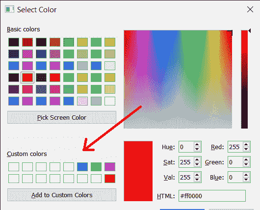
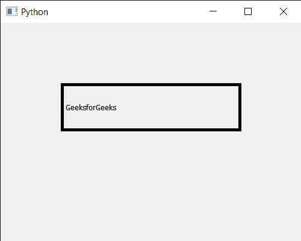

# PyQt5 qcolor dialog–设置自定义颜色

> 原文:[https://www . geeksforgeeks . org/pyqt5-qcolor dialog-setting-custom-color/](https://www.geeksforgeeks.org/pyqt5-qcolordialog-setting-custom-color/)

在本文中，我们将看到如何在 QColorDialog 小部件中设置自定义颜色。自定义颜色由用户制作的颜色它们可以在运行时通过鼠标的帮助来设置尽管我们可以通过编程来添加自定义颜色，但默认情况下所有自定义颜色都是白色的。下面是颜色对话框中自定义颜色的样子


为了做到这一点，我们对 QColorDialog 对象使用`setCustomColor`方法

> **语法:**对话框. setCustomColor(i，Color)
> 
> **自变量:**以整数即索引和 QColor 对象为自变量
> 
> **返回:**返回无

**注意:**此功能不适用于 macOS 平台上的原生颜色对话框。如果您仍然需要此功能，请使用 QColorDialog。DontUseNativeDialog 选项。

下面是实现

```py
# importing libraries
from PyQt5.QtWidgets import * 
from PyQt5 import QtCore, QtGui
from PyQt5.QtGui import * 
from PyQt5.QtCore import * 
import sys

class Window(QMainWindow):

    def __init__(self):
        super().__init__()

        # setting title
        self.setWindowTitle("Python ")

        # setting geometry
        self.setGeometry(100, 100, 500, 400)

        # calling method
        self.UiComponents()

        # showing all the widgets
        self.show()

    # method for components
    def UiComponents(self):

        # creating a QColorDialog object
        dialog = QColorDialog(self)

        # setting custom colors
        dialog.setCustomColor(1, Qt.red)
        dialog.setCustomColor(2, Qt.green)
        dialog.setCustomColor(3, Qt.yellow)
        dialog.setCustomColor(4, Qt.blue)

        # executing the dialog
        dialog.exec_()

        # creating label
        label = QLabel("GeeksforGeeks", self)

        # setting geometry to the label
        label.setGeometry(100, 100, 300, 80)

        # making label multi line
        label.setWordWrap(True)

        # setting stylesheet of the label
        label.setStyleSheet("QLabel"
                            "{"
                            "border : 5px solid black;"
                            "}")

        # getting the selected color
        color = dialog.selectedColor()

        # setting graphic effect to the label
        graphic = QGraphicsColorizeEffect(self)

        # setting color to the graphic
        graphic.setColor(color)

        # setting graphic to the label
        label.setGraphicsEffect(graphic)

# create pyqt5 app
App = QApplication(sys.argv)

# create the instance of our Window
window = Window()

# start the app
sys.exit(App.exec())
```

**输出:**


