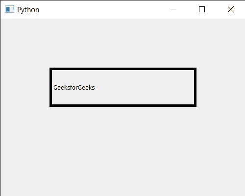

# PyQt5 qcolor Dialog–设置多种颜色对话框选项

> 原文:[https://www . geeksforgeeks . org/pyqt 5-qcolor dialog-设置-多种颜色-对话框-选项/](https://www.geeksforgeeks.org/pyqt5-qcolordialog-setting-multiple-color-dialog-options/)

在本文中，我们将看到如何设置 QColorDialog 小部件的多个选项。QColorDialog 小部件基本上有三个对话框选项，下面是选项
1。显示阿尔法通道:允许用户选择颜色的阿尔法分量
2。按钮:不显示确定和取消按钮
3。DontUseNativeDialog:用 Qt 的标准颜色对话框代替操作系统原生颜色对话框
默认所有选项都是禁用的，我们可以借助`setOption`方法设置单个选项

**注意:**在显示对话框前应设置选项。在对话框可见时设置它们并不能保证对对话框立即产生效果(取决于选项和平台)。

为了做到这一点，我们对 QColorDialog 对象使用`setOptions`方法

> **语法:**dialog . setoptions(qcolor dialog。显示 alpha 通道和 QColorDialog。DontUseNativeDialog)
> 
> **自变量:**以选项对象为自变量
> 
> **返回:**返回无

下面是实现

```
# importing libraries
from PyQt5.QtWidgets import * 
from PyQt5 import QtCore, QtGui
from PyQt5.QtGui import * 
from PyQt5.QtCore import * 
import sys

class Window(QMainWindow):

    def __init__(self):
        super().__init__()

        # setting title
        self.setWindowTitle("Python ")

        # setting geometry
        self.setGeometry(100, 100, 500, 400)

        # calling method
        self.UiComponents()

        # showing all the widgets
        self.show()

    # method for components
    def UiComponents(self):

        # creating a QColorDialog object
        dialog = QColorDialog(self)

        # setting multiple options
        dialog.setOptions(QColorDialog.DontUseNativeDialog and QColorDialog.ShowAlphaChannel)

        # executing the dialog
        dialog.exec_()

        # creating label
        label = QLabel("GeeksforGeeks", self)

        # setting geometry to the label
        label.setGeometry(100, 100, 300, 80)

        # making label multi line
        label.setWordWrap(True)

        # setting stylesheet of the label
        label.setStyleSheet("QLabel"
                            "{"
                            "border : 5px solid black;"
                            "}")

# create pyqt5 app
App = QApplication(sys.argv)

# create the instance of our Window
window = Window()

# start the app
sys.exit(App.exec())
```

**输出:**

