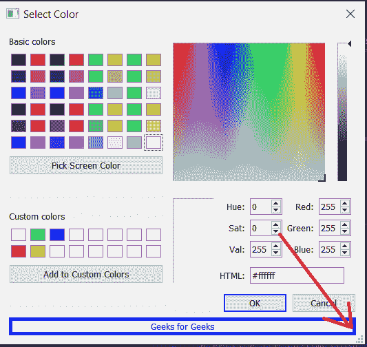

# PyQt5 qcolor dialog–设置尺寸夹点属性

> 原文:[https://www . geeksforgeeks . org/pyqt 5-qcolor dialog-setting-size-grip-property/](https://www.geeksforgeeks.org/pyqt5-qcolordialog-setting-size-grip-property/)

在本文中，我们将看到如何设置 QColorDialog 的大小手柄属性。启用此属性时，对话框的右下角会放置一个 QSizeGrip。默认情况下，尺寸夹点处于禁用状态。

为了做到这一点，我们对 QColorDialog 对象使用`setSizeGripEnabled`方法

> **语法:**对话框. setSizeGripEnabled(真)
> 
> **自变量:**它以布尔为自变量
> 
> **返回:**返回无

下面是实现

```
# importing libraries
from PyQt5.QtWidgets import * 
from PyQt5 import QtCore, QtGui
from PyQt5.QtGui import * 
from PyQt5.QtCore import * 
import sys

class Window(QMainWindow):

    def __init__(self):
        super().__init__()

        # setting title
        self.setWindowTitle("Python ")

        # setting geometry
        self.setGeometry(100, 100, 500, 400)

        # calling method
        self.UiComponents()

        # showing all the widgets
        self.show()

    # method for components
    def UiComponents(self):

        # creating a QColorDialog object
        dialog = QColorDialog(self)

        # setting custom colors
        dialog.setCustomColor(1, Qt.red)
        dialog.setCustomColor(2, Qt.green)
        dialog.setCustomColor(3, Qt.yellow)
        dialog.setCustomColor(4, Qt.blue)

        # setting grip size property enabled
        dialog.setSizeGripEnabled(True)

        # creating label
        label = QLabel("Geeks for Geeks", self)

        label.setAlignment(Qt.AlignCenter)

        # making label multi line
        label.setWordWrap(True)

        # setting stylesheet of the label
        label.setStyleSheet("QLabel"
                            "{"
                            "border : 5px solid black;"
                            "}")

        # getting the custom color
        color = dialog.customColor(4)

        # setting graphic effect to the label
        graphic = QGraphicsColorizeEffect(self)

        # setting color to the graphic
        graphic.setColor(color)

        # setting graphic to the label
        label.setGraphicsEffect(graphic)

        layout = dialog.layout()

        layout.addWidget(label)

        dialog.setLayout(layout)

        # getting dialog layout
        # value = dialog.layout()

        dialog.exec_()

        # setting text to the label
        # label.setText("Layout : " + str(value))

        self.deleteLater()

# create pyqt5 app
App = QApplication(sys.argv)

# create the instance of our Window
window = Window()

# start the app
sys.exit(App.exec())
```

**输出:**
