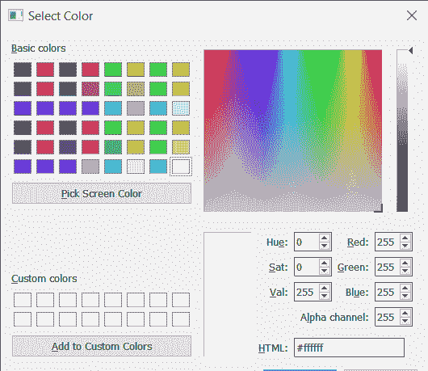
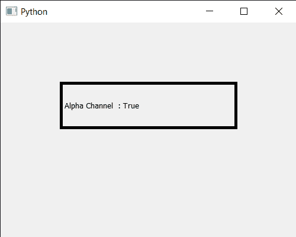

# PyQt5 qcolor Dialog–测试颜色对话框选项

> 原文:[https://www . geeksforgeeks . org/pyqt5-qcolor dialog-testing-color-dialog-options/](https://www.geeksforgeeks.org/pyqt5-qcolordialog-testing-color-dialog-options/)

在本文中，我们将看到如何检查 QColorDialog 小部件的选项。QColorDialog 小部件基本上有三个对话框选项，下面是选项
1。显示阿尔法通道:允许用户选择颜色的阿尔法分量
2。按钮:不显示确定和取消按钮
3。DontUseNativeDialog:用 Qt 的标准颜色对话框代替操作系统原生颜色对话框
默认所有选项都是禁用的，我们可以借助`setOption`方法设置单个选项，测试选项意味着检查给定选项是否启用

为了做到这一点，我们对 QColorDialog 对象使用`testOptions`方法

> **语法:**dialog . testoptions(QColorDialog。显示频道)
> 
> **自变量:**以选项对象为自变量
> 
> **返回:**如果给定选项被启用，则返回真；否则，返回 false。

下面是实现

```py
# importing libraries
from PyQt5.QtWidgets import * 
from PyQt5 import QtCore, QtGui
from PyQt5.QtGui import * 
from PyQt5.QtCore import * 
import sys

class Window(QMainWindow):

    def __init__(self):
        super().__init__()

        # setting title
        self.setWindowTitle("Python ")

        # setting geometry
        self.setGeometry(100, 100, 500, 400)

        # calling method
        self.UiComponents()

        # showing all the widgets
        self.show()

    # method for components
    def UiComponents(self):

        # creating a QColorDialog object
        dialog = QColorDialog(self)

        # setting option
        dialog.setOption(QColorDialog.ShowAlphaChannel)

        # executing the dialog
        dialog.exec_()

        # creating label
        label = QLabel("GeeksforGeeks", self)

        # setting geometry to the label
        label.setGeometry(100, 100, 300, 80)

        # making label multi line
        label.setWordWrap(True)

        # setting stylesheet of the label
        label.setStyleSheet("QLabel"
                            "{"
                            "border : 5px solid black;"
                            "}")

        color = Qt.black

        # setting graphic effect to the label
        graphic = QGraphicsColorizeEffect(self)

        # setting color to the graphic
        graphic.setColor(color)

        # setting graphic to the label
        label.setGraphicsEffect(graphic)

        # testing the option
        value = dialog.testOption(QColorDialog.ShowAlphaChannel)

        # setting text to the label
        label.setText("Alpha Channel  : " + str(value))

# create pyqt5 app
App = QApplication(sys.argv)

# create the instance of our Window
window = Window()

# start the app
sys.exit(App.exec())
```

**输出:**


