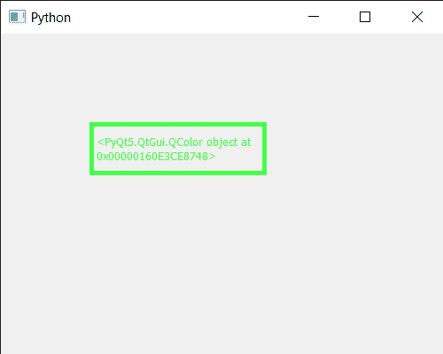

# pyqt 5–qcolordialog

> 哎哎哎:# t0]https://www . geeksforgeeks . org/pyqt 5-qcolordialog/

**QColorDialog** 是一个拾色器小部件的对话框。颜色选择器是一种图形用户界面小部件，通常在图形软件或在线上找到，用于选择颜色，有时也用于创建配色方案。下面是 QColorDialog 的外观


这是 PyQt5 中的弹出型小部件，它的基本用途是允许用户选择颜色，这种小部件在设计应用程序(如绘画)时非常有用。

**示例:**
在本例中，我们将创建一个 PyQt5 应用程序，该应用程序在执行时将打开颜色对话框，当用户选择颜色并关闭对话框时，将出现我们的主窗口，该窗口有一个标签，其颜色将与对话框中选择的颜色相同。4

下面是实现

```
# importing libraries
from PyQt5.QtWidgets import * 
from PyQt5 import QtCore, QtGui
from PyQt5.QtGui import * 
from PyQt5.QtCore import * 
import sys

class Window(QMainWindow):

    def __init__(self):
        super().__init__()

        # setting title
        self.setWindowTitle("Python ")

        # setting geometry
        self.setGeometry(100, 100, 500, 400)

        # calling method
        self.UiComponents()

        # showing all the widgets
        self.show()

    # method for components
    def UiComponents(self):

        # opening color dialog
        color = QColorDialog.getColor()

        # creating label to display the color
        label = QLabel(self)

        # setting geometry to the label
        label.setGeometry(100, 100, 200, 60)

        # making label multi line
        label.setWordWrap(True)

        # setting stylesheet of the label
        label.setStyleSheet("QLabel"
                            "{"
                            "border : 5px solid black;"
                            "}")

        # setting text to the label
        label.setText(str(color))

        # setting graphic effect to the label
        graphic = QGraphicsColorizeEffect(self)

        # setting color to the graphic
        graphic.setColor(color)

        # setting graphic to the label
        label.setGraphicsEffect(graphic)

# create pyqt5 app
App = QApplication(sys.argv)

# create the instance of our Window
window = Window()

# start the app
sys.exit(App.exec())
```

**输出:**

<video class="wp-video-shortcode" id="video-434801-1" width="640" height="516" preload="metadata" controls=""><source type="video/mp4" src="https://media.geeksforgeeks.org/wp-content/uploads/20200619004614/Select-Color-2020-06-19-00-45-43.mp4?_=1">[https://media.geeksforgeeks.org/wp-content/uploads/20200619004614/Select-Color-2020-06-19-00-45-43.mp4](https://media.geeksforgeeks.org/wp-content/uploads/20200619004614/Select-Color-2020-06-19-00-45-43.mp4)</video>
