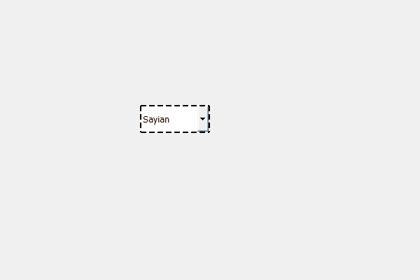

# PyQt5 QComboBox–更改边框样式

> 原文:[https://www . geesforgeks . org/pyqt5-qcombobox-change-border-style/](https://www.geeksforgeeks.org/pyqt5-qcombobox-change-border-style/)

在本文中，我们将看到如何改变组合框的边框样式，边框样式可以是点状、虚线等。当我们为组合框设置边框时，它是连续的，尽管我们可以更改它。

为了做到这一点，我们必须更改与组合框关联的样式表，下面是样式表代码

```py
QComboBox
{
border : 2px black;
border-style : dotted;
}

```

下面是实现

```py
# importing libraries
from PyQt5.QtWidgets import * 
from PyQt5 import QtCore, QtGui
from PyQt5.QtGui import * 
from PyQt5.QtCore import * 
import sys

class Window(QMainWindow):

    def __init__(self):
        super().__init__()

        # setting title
        self.setWindowTitle("Python ")

        # setting geometry
        self.setGeometry(100, 100, 600, 400)

        # calling method
        self.UiComponents()

        # showing all the widgets
        self.show()

    # method for widgets
    def UiComponents(self):
        # creating a check-able combo box object
        self.combo_box = QComboBox(self)

        # setting geometry of combo box
        self.combo_box.setGeometry(200, 150, 100, 40)

        # geek list
        geek_list = ["Sayian", "Super Sayian", "Super Sayian 2", "Super Sayian B"]

        # adding list of items to combo box
        self.combo_box.addItems(geek_list)

        # setting stylesheet of the combo box
        # set the border style
        self.combo_box.setStyleSheet("QComboBox"
                                     "{"
                                     "border : 2px black;"
                                     "border-style : dashed;"
                                     "}")

# create pyqt5 app
App = QApplication(sys.argv)

# create the instance of our Window
window = Window()

# start the app
sys.exit(App.exec())
```

**输出:**
