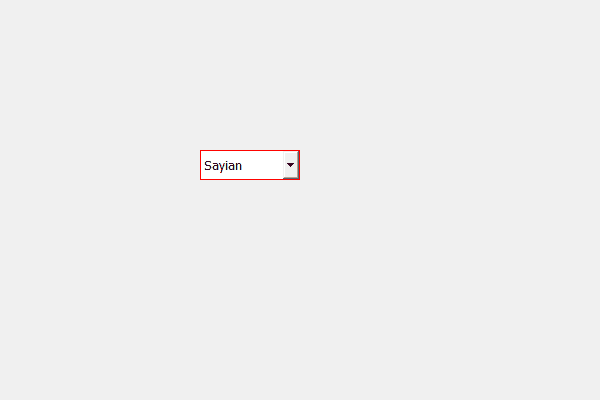

# PyQt5 QComboBox–设置鼠标跟踪

> 原文:[https://www . geesforgeks . org/pyqt 5-qcombobox-setting-mouse-tracking/](https://www.geeksforgeeks.org/pyqt5-qcombobox-setting-mouse-tracking/)

在本文中，我们将看到如何将鼠标跟踪设置为组合框，当任何按钮被按下时，组合框接收关于鼠标的信号，但是在鼠标跟踪之后，即使没有按下任何按钮，它也将接收关于鼠标的所有信号。默认情况下，此属性为假。

> 为了打开鼠标跟踪，我们使用`setMouseTracking`方法
> 
> **语法:**组合框
> 
> **自变量:**它以布尔为自变量
> 
> **返回:**返回无

下面是实现

```py
# importing libraries
from PyQt5.QtWidgets import * 
from PyQt5 import QtCore, QtGui
from PyQt5.QtGui import * 
from PyQt5.QtCore import * 
import sys

class Window(QMainWindow):

    def __init__(self):
        super().__init__()

        # setting title
        self.setWindowTitle("Python ")

        # setting geometry
        self.setGeometry(100, 100, 600, 400)

        # calling method
        self.UiComponents()

        # showing all the widgets
        self.show()

    # method for widgets
    def UiComponents(self):
        # creating a check-able combo box object
        self.combo_box = QComboBox(self)

        # setting geometry of combo box
        self.combo_box.setGeometry(200, 150, 100, 30)

        # geek list
        geek_list = ["Sayian", "Super Sayian", "Super Sayian 2", "Super Sayian B"]

        # adding list of items to combo box
        self.combo_box.addItems(geek_list)

        # setting mouse tracking
        self.combo_box.setMouseTracking(True)

        # setting stylesheet of the combo box
        self.combo_box.setStyleSheet("border : 1px solid red;")

# create pyqt5 app
App = QApplication(sys.argv)

# create the instance of our Window
window = Window()

# start the app
sys.exit(App.exec())
```

**输出:**
