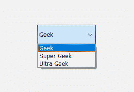

# pyqt 5–QQ combobox

> 哎哎哎:# t0]https://www . geeksforgeeks . org/pyqt 5-qcombobox/

**QComboBox** 是 PyQt5 中的一个小部件，用来从列表中进行选择。当我们点击组合框时，它占用的空间最小，下拉列表就出现了，我们可以从中选择项目。`QComboBox`类用于在应用程序中添加组合框。以下是组合外观的图示–


**示例:**
在本例中，我们将在窗口中创建一个组合框，允许我们在“极客”、“超级极客”和“超级极客”之间进行选择

以下是代码–

```py
# importing libraries
from PyQt5.QtWidgets import * 
from PyQt5 import QtCore, QtGui
from PyQt5.QtGui import * 
from PyQt5.QtCore import * 
import sys

class Window(QMainWindow):

    def __init__(self):
        super().__init__()

        # setting title
        self.setWindowTitle("Python ")

        # setting geometry
        self.setGeometry(100, 100, 600, 400)

        # calling method
        self.UiComponents()

        # showing all the widgets
        self.show()

    # method for widgets
    def UiComponents(self):

        # creating a combo box widget
        combo_box = QComboBox(self)

        # setting geometry of combo box
        combo_box.setGeometry(200, 150, 120, 40)

        # adding items to combo box
        combo_box.addItem("Geek")
        combo_box.addItem("Super Geek")
        combo_box.addItem("Ultra Geek")

# create pyqt5 app
App = QApplication(sys.argv)

# create the instance of our Window
window = Window()

# start the app
sys.exit(App.exec())
```

**输出:**

<video class="wp-video-shortcode" id="video-396219-1" width="640" height="428" preload="metadata" controls=""><source type="video/mp4" src="https://media.geeksforgeeks.org/wp-content/uploads/20200410181342/Python-10-04-2020-18_13_17.mp4?_=1">[https://media.geeksforgeeks.org/wp-content/uploads/20200410181342/Python-10-04-2020-18_13_17.mp4](https://media.geeksforgeeks.org/wp-content/uploads/20200410181342/Python-10-04-2020-18_13_17.mp4)</video>