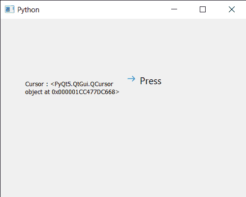

# PyQt5 qcommand link button–访问光标

> 原文:[https://www . geeksforgeeks . org/pyqt 5-qcommandlink button-access-cursor/](https://www.geeksforgeeks.org/pyqt5-qcommandlinkbutton-accessing-cursor/)

在本文中，我们将看到如何获取 QCommandLinkButton 的访问光标。分配光标意味着当鼠标光标在命令链接按钮上时，它将呈现新的形状。光标形状基本上是光标图标，用于对动作进行分类。可以借助`setCursor`方法进行设置。

为此，我们对命令链接按钮对象使用`cursor`方法

> **语法:**按钮.光标()
> 
> **论证:**不需要论证
> 
> **返回:**返回 QCursor 对象

下面是实现

```py
# importing libraries
from PyQt5.QtWidgets import * 
from PyQt5 import QtCore, QtGui
from PyQt5.QtGui import * 
from PyQt5.QtCore import * 
import sys

class Window(QMainWindow):

    def __init__(self):
        super().__init__()

        # setting title
        self.setWindowTitle("Python ")

        # setting geometry
        self.setGeometry(100, 100, 500, 400)

        # calling method
        self.UiComponents()

        # showing all the widgets
        self.show()

    # method for components
    def UiComponents(self):

        # creating a command link button
        cl_button = QCommandLinkButton("Press", self)

        # setting geometry
        cl_button.setGeometry(250, 100, 200, 50)

        # cursor
        cursor = Qt.OpenHandCursor

        # setting cursor
        cl_button.setCursor(cursor)

        # creating label
        label = QLabel("GeeksforGeeks", self)

        # setting label geometry
        label.setGeometry(50, 100, 200, 80)

        # making label multiline
        label.setWordWrap(True)

        # getting cursor
        value = cl_button.cursor()

        # getting cursor
        label.setText("Cursor : " + str(value))

# create pyqt5 app
App = QApplication(sys.argv)

# create the instance of our Window
window = Window()

# start the app
sys.exit(App.exec())
```

**输出:**
