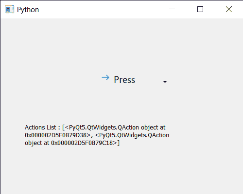

# PyQt5 qcommandlink button–添加动作对象

> 原文:[https://www . geeksforgeeks . org/pyqt 5-qcommandlink button-add-actions-object/](https://www.geeksforgeeks.org/pyqt5-qcommandlinkbutton-adding-actions-object/)

在本文中，我们将看到如何向 QCommandLinkButton 添加操作。默认情况下，命令链接按钮有一个空的动作列表，即在动作列表中没有元素，尽管通过向命令链接按钮的菜单添加动作，我们可以在动作列表中添加元素。我们使用`addAction`和`addActions`方法同时添加单个和多个动作。

为此，我们对命令链接按钮对象使用`addAction`和`addActions`方法

> **语法:** button.addAction(动作)和 button.addActions(动作 _ 列表)
> 
> **参数:**他们以 qaaction 对象和 qaaction 列表作为参数
> 
> **返回:**它们不返回

下面是实现

```py
# importing libraries
from PyQt5.QtWidgets import * 
from PyQt5 import QtCore, QtGui
from PyQt5.QtGui import * 
from PyQt5.QtCore import * 
import sys

class Window(QMainWindow):

    def __init__(self):
        super().__init__()

        # setting title
        self.setWindowTitle("Python ")

        # setting geometry
        self.setGeometry(100, 100, 500, 400)

        # calling method
        self.UiComponents()

        # showing all the widgets
        self.show()

    # method for components
    def UiComponents(self):

        # creating a command link button
        cl_button = QCommandLinkButton("Press", self)

        # setting geometry
        cl_button.setGeometry(200, 100, 150, 60)

        # QActions
        a = QAction("Next Geeks", self)
        b = QAction("Previous Geeks", self)

        # QMenu
        menu = QMenu()

        # adding actions to menu
        menu.addActions([a, b])

        # setting menu to the button
        cl_button.setMenu(menu)

        # creating QAction object
        q = QAction("Action")

        # adding action to the button
        cl_button.addAction(q)

        # creating label
        label = QLabel("GeeksforGeeks", self)

        # setting label geometry
        label.setGeometry(50, 200, 300, 80)

        # making label multiline
        label.setWordWrap(True)

        # getting action list
        value = cl_button.actions()

        # setting text to the label
        label.setText("Actions List : " + str(value))

# create pyqt5 app
App = QApplication(sys.argv)

# create the instance of our Window
window = Window()

# start the app
sys.exit(App.exec())
```

**输出:**
