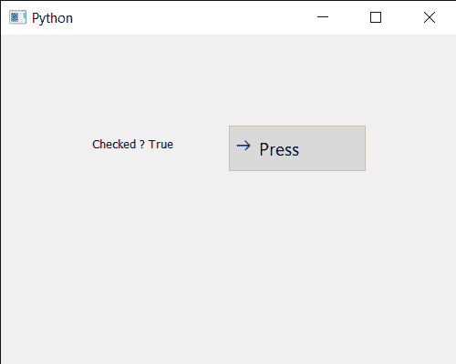

# PYqt5 Qcommand link 按钮–检查检查状态

> 原文:[https://www . geeksforgeeks . org/pyqt 5-qcommandlink button-checking-check-state/](https://www.geeksforgeeks.org/pyqt5-qcommandlinkbutton-checking-check-state/)

在本文中，我们将看到如何检查可检查的 QCommandLinkButton 是选中还是未选中，默认情况下它是不可检查的，尽管我们可以借助`setCheckable`方法使其随时可检查。此外，当它可检查时，它的状态是未检查的，尽管我们可以通过`setChecked`方法以编程方式检查它的状态。

为此，我们对命令链接按钮对象使用`isChecked`方法

> **语法:** button.isChecked()
> 
> **论证:**不需要论证
> 
> **返回:**返回 bool

下面是实现

```
# importing libraries
from PyQt5.QtWidgets import * 
from PyQt5 import QtCore, QtGui
from PyQt5.QtGui import * 
from PyQt5.QtCore import *
import sys

class Window(QMainWindow):

    def __init__(self):
        super().__init__()

        # setting title
        self.setWindowTitle("Python ")

        # setting geometry
        self.setGeometry(100, 100, 500, 400)

        # calling method
        self.UiComponents()

        # showing all the widgets
        self.show()

    # method for components
    def UiComponents(self):

        # creating a command link button
        cl_button = QCommandLinkButton("Press", self)

        # setting geometry
        cl_button.setGeometry(250, 100, 150, 50)

        # making it checkable
        cl_button.setCheckable(True)

        # making its state checked
        cl_button.setChecked(True)

        # creating label
        label = QLabel("GeeksforGeeks", self)

        # setting label geometry
        label.setGeometry(100, 100, 200, 40)

        # making label multiline
        label.setWordWrap(True)

        # checking if button is in checked state
        value = cl_button.isChecked()

        # setting text to the label
        label.setText("Checked ? " + str(value))

# create pyqt5 app
App = QApplication(sys.argv)

# create the instance of our Window
window = Window()

# start the app
sys.exit(App.exec())
```

**输出:**
