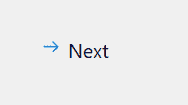

# PyQt5–qcommandlink button 类

> 原文:[https://www . geeksforgeeks . org/pyqt 5-qcommandlink button-class/](https://www.geeksforgeeks.org/pyqt5-qcommandlinkbutton-class/)

**QCommandLinkButton** 是 Windows Vista 推出的控件小部件。它的预期用途类似于单选按钮，因为它用于在一组互斥选项之间进行选择。它的外观通常类似于平面按钮，但除了正常的按钮文本之外，它还允许有描述性文本。默认情况下，它还会带有一个箭头图标，指示按下控件将打开另一个窗口或页面或做一些事情。下面是命令链接按钮的外观



**示例:**
我们将创建一个具有标签和命令链接按钮的窗口，当命令链接按钮被按下时，标签中的计数器将递增

下面是实现

```py
# importing libraries
from PyQt5.QtWidgets import * 
from PyQt5 import QtCore, QtGui
from PyQt5.QtGui import * 
from PyQt5.QtCore import * 
import sys

class Window(QMainWindow):

    def __init__(self):
        super().__init__()

        # setting title
        self.setWindowTitle("Python ")

        # setting geometry
        self.setGeometry(100, 100, 500, 400)

        # calling method
        self.UiComponents()

        # showing all the widgets
        self.show()

    # method for components
    def UiComponents(self):

        # counter value
        self.n = 0

        # creating label
        label = QLabel("Counter", self)

        # setting label geometry
        label.setGeometry(100, 100, 100, 40)

        # creating a command link button
        cl_button = QCommandLinkButton("Next", self)

        # setting geometry
        cl_button.setGeometry(200, 100, 200, 40)

        # adding action to the button
        cl_button.clicked.connect(lambda: increment(self.n))

        # method for incrementing the counter
        def increment(n):

            # increment
            self.n = n + 1

            # setting text to the label
            label.setText(str(self.n))

# create pyqt5 app
App = QApplication(sys.argv)

# create the instance of our Window
window = Window()

# start the app
sys.exit(App.exec())
```

**输出:**

<video class="wp-video-shortcode" id="video-439175-1" width="640" height="512" preload="metadata" controls=""><source type="video/mp4" src="https://media.geeksforgeeks.org/wp-content/uploads/20200624233649/Python-2020-06-24-23-36-28.mp4?_=1">[https://media.geeksforgeeks.org/wp-content/uploads/20200624233649/Python-2020-06-24-23-36-28.mp4](https://media.geeksforgeeks.org/wp-content/uploads/20200624233649/Python-2020-06-24-23-36-28.mp4)</video>