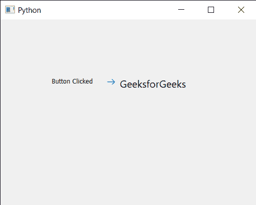

# 点击按钮

> 原文:[https://www . geeksforgeeks . org/pyqt 5-qcommandlink button-clicking-it/](https://www.geeksforgeeks.org/pyqt5-qcommandlinkbutton-clicking-it/)

在本文中，我们将看到如何设置 QCommandLinkButton 的动画点击属性。可以借助`click`方法完成。此方法执行单击。所有与咔哒声相关的常见信号都会在适当的时候发出。如果按钮被禁用，此功能不起作用。

为此，我们对命令链接按钮对象使用`click`方法

> **语法:**按钮，点击()
> 
> **论证:**不需要论证
> 
> **返回:**返回无

下面是实现

```
# importing libraries
from PyQt5.QtWidgets import * 
from PyQt5 import QtCore, QtGui
from PyQt5.QtGui import * 
from PyQt5.QtCore import * 
import sys

class Window(QMainWindow):

    def __init__(self):
        super().__init__()

        # setting title
        self.setWindowTitle("Python ")

        # setting geometry
        self.setGeometry(100, 100, 500, 400)

        # calling method
        self.UiComponents()

        # showing all the widgets
        self.show()

    # method for components
    def UiComponents(self):

        # creating a command link button
        cl_button = QCommandLinkButton("GeeksforGeeks", self)

        # setting geometry
        cl_button.setGeometry(200, 100, 200, 50)

        # creating label
        label = QLabel(self)

        # setting label geometry
        label.setGeometry(100, 100, 100, 40)

        # adding action to the button
        cl_button.clicked.connect(lambda: label.setText("Button Clicked"))

        # click the button
        cl_button.click()

# create pyqt5 app
App = QApplication(sys.argv)

# create the instance of our Window
window = Window()

# start the app
sys.exit(App.exec())
```

**输出:**
