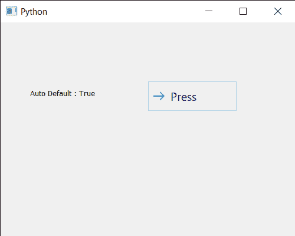

# PyQt5 qcommandlink 按钮–获取自动默认属性

> 原文:[https://www . geesforgeks . org/pyqt5-qcommandlink button-get-auto-default-property/](https://www.geeksforgeeks.org/pyqt5-qcommandlinkbutton-getting-auto-default-property/)

在本文中，我们将看到如何获取 QCommandLinkButton 的自动默认属性。如果此属性设置为 true，则命令链接按钮是自动默认按钮。在某些图形用户界面样式中，默认按钮周围会画有一个额外的框架，最多可达 3 个像素或更多。Qt 自动保持自动默认按钮周围的空间，即自动默认按钮可能有一个稍大的尺寸提示。这个属性可以借助`setAutoDefault`方法进行设置。

为此，我们对命令链接按钮对象使用`autoDefault`方法

> **语法:**按钮.自动默认()
> 
> **论证:**不需要论证
> 
> **返回:**返回 bool

下面是实现

```
# importing libraries
from PyQt5.QtWidgets import * 
from PyQt5 import QtCore, QtGui
from PyQt5.QtGui import * 
from PyQt5.QtCore import * 
import sys

class Window(QMainWindow):

    def __init__(self):
        super().__init__()

        # setting title
        self.setWindowTitle("Python ")

        # setting geometry
        self.setGeometry(100, 100, 500, 400)

        # calling method
        self.UiComponents()

        # showing all the widgets
        self.show()

    # method for components
    def UiComponents(self):

        # creating a command link button
        cl_button = QCommandLinkButton("Press", self)

        # setting geometry
        cl_button.setGeometry(250, 100, 150, 50)

        # making it checkable
        cl_button.setCheckable(True)

        # setting auto default property
        cl_button.setAutoDefault(True)

        # size
        size = QSize(30, 30)

        # setting icon size
        cl_button.setIconSize(size)

        # creating label
        label = QLabel("GeeksforGeeks", self)

        # setting label geometry
        label.setGeometry(50, 100, 200, 40)

        # making label multiline
        label.setWordWrap(True)

        # getting auto default property
        value = cl_button.autoDefault()

        # setting text to the label
        label.setText("Auto Default : " + str(value))

# create pyqt5 app
App = QApplication(sys.argv)

# create the instance of our Window
window = Window()

# start the app
sys.exit(App.exec())
```

**输出:**
