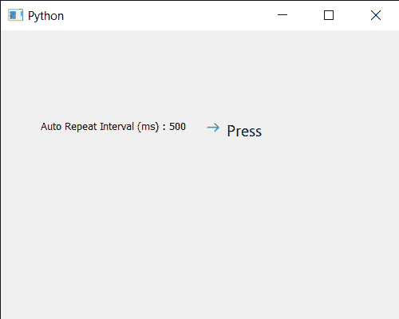

# PyQt5 qcommandlink 按钮–获取自动重复间隔时间

> 原文:[https://www . geesforgeks . org/pyqt5-qcommandlink button-get-auto-repeat-interval-time/](https://www.geeksforgeeks.org/pyqt5-qcommandlinkbutton-getting-auto-repeat-interval-time/)

在本文中，我们将看到如何获得 QCommandLinkButton 按钮的自动重复间隔时间。当自动重复属性启用时，它以毫秒为单位定义自动重复间隔的长度。在自动重复属性中，当命令链接按钮按下时，按下、释放和单击的信号会定期发出。自动重复属性在默认情况下是关闭的，尽管它可以在 setAutoRepeat 方法的帮助下启用。可以借助 setAutoRepeatDelay 方法设置间隔时间。

为此，我们对命令链接按钮对象使用自动重复延迟方法

> **语法:**button . autorepeatdelay()
> **参数:**不需要参数
> **返回:**返回整数

下面是实现

## 蟒蛇 3

```py
# importing libraries
from PyQt5.QtWidgets import *
from PyQt5 import QtCore, QtGui
from PyQt5.QtGui import *
from PyQt5.QtCore import *
import sys

class Window(QMainWindow):

    def __init__(self):
        super().__init__()

        # setting title
        self.setWindowTitle("Python ")

        # setting geometry
        self.setGeometry(100, 100, 500, 400)

        # calling method
        self.UiComponents()

        # showing all the widgets
        self.show()

    # method for components
    def UiComponents(self):
        # creating a command link button
        cl_button = QCommandLinkButton("Press", self)

        # setting geometry
        cl_button.setGeometry(250, 100, 200, 50)

        # setting auto repeat
        cl_button.setAutoRepeat(True)

        # setting interval time 500 milliseconds
        cl_button.setAutoRepeatInterval(500)

        # creating label
        label = QLabel("GeeksforGeeks", self)

        # setting label geometry
        label.setGeometry(50, 100, 200, 40)

        # getting auto repeat interval
        value = cl_button.autoRepeatInterval()

        # setting text to the label
        label.setText("Auto Repeat Interval (ms) : " + str(value))

        # counter
        self.counter = 0

        # adding action to the button
        cl_button.clicked.connect(lambda: update_label())

        # method for updating label text
        def update_label():

            # setting label text
            label.setText(str(self.counter))

            # incrementing the counter
            self.counter += 1

# create pyqt5 app
App = QApplication(sys.argv)

# create the instance of our Window
window = Window()

# start the app
sys.exit(App.exec())
```

**输出:**

