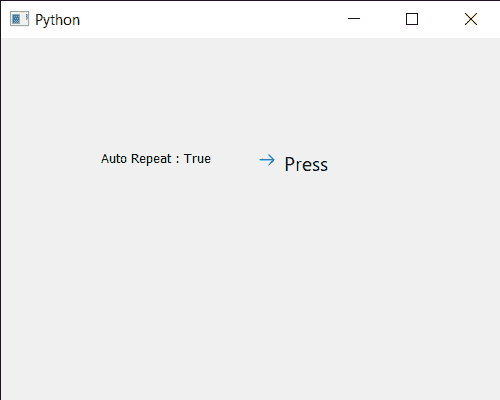

# PyQt5 qcommandlink 按钮–获取自动重复属性

> 原文:[https://www . geesforgeks . org/pyqt5-qcommandlink button-get-auto-repeat-property/](https://www.geeksforgeeks.org/pyqt5-qcommandlinkbutton-getting-auto-repeat-property/)

在本文中，我们将看到如何获得 QCommandLinkButton 的自动重复属性。如果启用了自动重复属性，则当命令链接按钮按下时，`pressed`、`released`和`clicked`信号会定期发出。默认情况下，自动重复属性处于关闭状态。初始延迟和重复间隔由`autoRepeatDelay`和`autoRepeatInterval`方法以毫秒为单位定义。这个属性可以借助`setAutoRepeat`方法设置到命令链接按钮。

为此，我们对命令链接按钮对象使用`autoRepeat`方法

> **语法:**按钮.自动重复()
> 
> **论证:**不需要论证
> 
> **返回:**返回 bool

下面是实现

```
# importing libraries
from PyQt5.QtWidgets import * 
from PyQt5 import QtCore, QtGui
from PyQt5.QtGui import * 
from PyQt5.QtCore import * 
import sys

class Window(QMainWindow):

    def __init__(self):
        super().__init__()

        # setting title
        self.setWindowTitle("Python ")

        # setting geometry
        self.setGeometry(100, 100, 500, 400)

        # calling method
        self.UiComponents()

        # showing all the widgets
        self.show()

    # method for components
    def UiComponents(self):
        # creating a command link button
        cl_button = QCommandLinkButton("Press", self)

        # setting geometry
        cl_button.setGeometry(250, 100, 200, 50)

        # setting auto repeat
        cl_button.setAutoRepeat(True)

        # creating label
        label = QLabel("GeeksforGeeks", self)

        # setting label geometry
        label.setGeometry(100, 100, 200, 40)

        # getting auto repeat property
        value = cl_button.autoRepeat()

        # setting text to the label
        label.setText("Auto Repeat : " + str(value))

        # counter
        self.counter = 0

        # adding action to the button
        cl_button.clicked.connect(lambda: update_label())

        # method for updating label text
        def update_label():

            # setting label text
            label.setText(str(self.counter))

            # incrementing the counter
            self.counter += 1

# create pyqt5 app
App = QApplication(sys.argv)

# create the instance of our Window
window = Window()

# start the app
sys.exit(App.exec())
```

**输出:**
