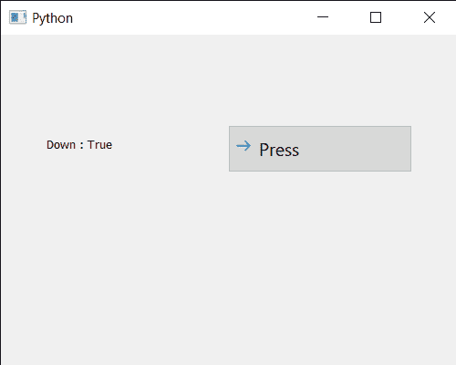

# PyQt5 qcommandlink button–向下属性

> 原文:[https://www . geeksforgeeks . org/pyqt 5-qcommandlink button-get-down-property/](https://www.geeksforgeeks.org/pyqt5-qcommandlinkbutton-getting-down-property/)

在本文中，我们将看到如何获取 QCommandLinkButton 的 down 属性。Down 属性控制命令链接按钮是否被按下。如果该属性为真，则按下按钮。如果我们将该属性设置为真，则不会发出信号`pressed`和`clicked`。默认情况下，此属性为 false。我们可以借助`setDown`方法设置这个属性。

为此，我们对命令链接按钮对象使用`isDown`方法

> **语法:** button.isDown()
> 
> **论证:**不需要论证
> 
> **返回:**返回 bool

下面是实现

```py
# importing libraries
from PyQt5.QtWidgets import * 
from PyQt5 import QtCore, QtGui
from PyQt5.QtGui import * 
from PyQt5.QtCore import * 
import sys

class Window(QMainWindow):

    def __init__(self):
        super().__init__()

        # setting title
        self.setWindowTitle("Python ")

        # setting geometry
        self.setGeometry(100, 100, 500, 400)

        # calling method
        self.UiComponents()

        # showing all the widgets
        self.show()

    # method for components
    def UiComponents(self):

        # creating a command link button
        cl_button = QCommandLinkButton("Press", self)

        # setting geometry
        cl_button.setGeometry(250, 100, 200, 50)

        # setting down property
        cl_button.setDown(True)

        # creating label
        label = QLabel("GeeksforGeeks", self)

        # setting label geometry
        label.setGeometry(50, 100, 200, 40)

        # getting down property
        value = cl_button.isDown()
        # setting text to the label
        label.setText("Down : " + str(value))

# create pyqt5 app
App = QApplication(sys.argv)

# create the instance of our Window
window = Window()

# start the app
sys.exit(App.exec())
```

**输出:**
