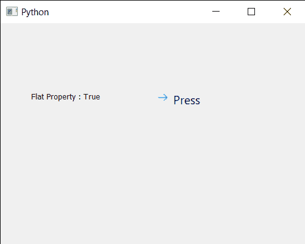

# PyQt5 qcommand link button–变平属性

> 原文:[https://www . geeksforgeeks . org/pyqt5-qcommandlink button-get-flat-property/](https://www.geeksforgeeks.org/pyqt5-qcommandlinkbutton-getting-flat-property/)

在本文中，我们将看到如何获得 QCommandLinkButton 的平面属性。此属性保存是否引发命令链接按钮边框。此属性的默认值为 false。如果启用此属性，大多数样式都不会绘制命令链接按钮背景，除非正在按下该按钮。我们可以借助`setFlat`方法设置这个属性。

为此，我们对命令链接按钮对象使用`isFlat`方法

> **语法:** button.isFlat()
> 
> **论证:**不需要论证
> 
> **返回:**返回 bool

下面是实现

```
# importing libraries
from PyQt5.QtWidgets import * 
from PyQt5 import QtCore, QtGui
from PyQt5.QtGui import * 
from PyQt5.QtCore import * 
import sys

class Window(QMainWindow):

    def __init__(self):
        super().__init__()

        # setting title
        self.setWindowTitle("Python ")

        # setting geometry
        self.setGeometry(100, 100, 500, 400)

        # calling method
        self.UiComponents()

        # showing all the widgets
        self.show()

    # method for components
    def UiComponents(self):

        # creating a command link button
        cl_button = QCommandLinkButton("Press", self)

        # setting geometry
        cl_button.setGeometry(250, 100, 200, 50)

        # setting flat property
        cl_button.setFlat(True)
        # creating label
        label = QLabel("GeeksforGeeks", self)

        # setting label geometry
        label.setGeometry(50, 100, 200, 40)

        # getting flat property
        value = cl_button.isFlat()

        # setting text to the label
        label.setText("Flat Property : " + str(value))

# create pyqt5 app
App = QApplication(sys.argv)

# create the instance of our Window
window = Window()

# start the app
sys.exit(App.exec())
```

**输出:**
