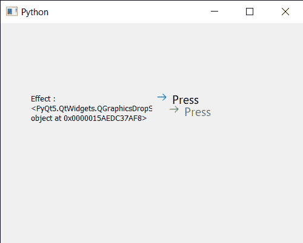

# PyQt5 qcommand link button–获取图形效果

> 原文:[https://www . geeksforgeeks . org/pyqt5-qcommandlink button-get-graphics-effects/](https://www.geeksforgeeks.org/pyqt5-qcommandlinkbutton-getting-graphics-effects/)

在本文中，我们将看到如何为 QCommandLinkButton 设置图形效果。图形效果可以是阴影、模糊或颜色效果，这些效果可以随时更改，也可以随时创建新效果。如果此命令链接按钮上已经安装了效果，`QWidget`将在安装新效果之前删除现有效果。图形效果可以借助`setGraphicsEffect`方法设置到命令链接按钮。

为此，我们对命令链接按钮对象使用`graphicsEffect`方法

> **语法:** button.graphicsEffect()
> 
> **论证:**不需要论证
> 
> **返回:**返回 QGraphicEffect 对象

下面是实现

```
# importing libraries
from PyQt5.QtWidgets import * 
from PyQt5 import QtCore, QtGui
from PyQt5.QtGui import * 
from PyQt5.QtCore import * 
import sys

class Window(QMainWindow):

    def __init__(self):
        super().__init__()

        # setting title
        self.setWindowTitle("Python ")

        # setting geometry
        self.setGeometry(100, 100, 500, 400)

        # calling method
        self.UiComponents()

        # showing all the widgets
        self.show()

    # method for components
    def UiComponents(self):

        # creating a command link button
        cl_button = QCommandLinkButton("Press", self)

        # setting geometry
        cl_button.setGeometry(250, 100, 200, 50)

        # shadow effect
        effect = QGraphicsDropShadowEffect()
        effect.setOffset(20, 20)

        # setting effect to the command link button
        cl_button.setGraphicsEffect(effect)

        # creating label
        label = QLabel("GeeksforGeeks", self)

        # setting label geometry
        label.setGeometry(50, 100, 200, 80)

        # making label multiline
        label.setWordWrap(True)

        # getting graphic effect
        value = cl_button.graphicsEffect()

        # setting text to the label
        label.setText("Effect : " + str(value))

# create pyqt5 app
App = QApplication(sys.argv)

# create the instance of our Window
window = Window()

# start the app
sys.exit(App.exec())
```

**输出:**
