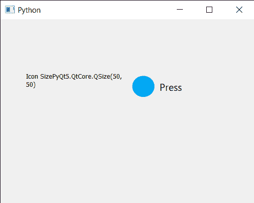

# PyQt5 qcommandlink 按钮–获取图标尺寸

> 原文:[https://www . geeksforgeeks . org/pyqt5-qcommandlink button-get-icon-size/](https://www.geeksforgeeks.org/pyqt5-qcommandlinkbutton-getting-icon-size/)

在本文中，我们将看到如何获得 QCommandLinkButton 的图标大小。默认情况下，一个箭头被设置为命令链接按钮的图标，尽管我们可以在`setIcon`方法的帮助下随时更改它。图标大小改变命令链接按钮图标的大小，可以借助`setIconSize`方法完成。

为此，我们对命令链接按钮对象使用`iconSize`方法

> **语法:** button.iconSize()
> 
> **论证:**不需要论证
> 
> **返回:**返回 QSize 对象

下面是实现

```py
# importing libraries
from PyQt5.QtWidgets import * 
from PyQt5 import QtCore, QtGui
from PyQt5.QtGui import * 
from PyQt5.QtCore import * 
import sys

class Window(QMainWindow):

    def __init__(self):
        super().__init__()

        # setting title
        self.setWindowTitle("Python ")

        # setting geometry
        self.setGeometry(100, 100, 500, 400)

        # calling method
        self.UiComponents()

        # showing all the widgets
        self.show()

    # method for components
    def UiComponents(self):

        # creating a command link button
        cl_button = QCommandLinkButton("Press", self)

        # setting geometry
        cl_button.setGeometry(250, 100, 150, 60)

        # making it checkable
        cl_button.setCheckable(True)

        # icon
        icon = QIcon('logo.png')

        # changing icon
        cl_button.setIcon(icon)

        # size
        size = QSize(50, 50)

        # setting icon size
        cl_button.setIconSize(size)

        # creating label
        label = QLabel("GeeksforGeeks", self)

        # setting label geometry
        label.setGeometry(50, 100, 200, 40)

        # making label multiline
        label.setWordWrap(True)

        # getting icon size
        value = cl_button.iconSize()

        # setting text to the label
        label.setText("Icon Size" + str(value))

# create pyqt5 app
App = QApplication(sys.argv)

# create the instance of our Window
window = Window()

# start the app
sys.exit(App.exec())
```

**输出:**
