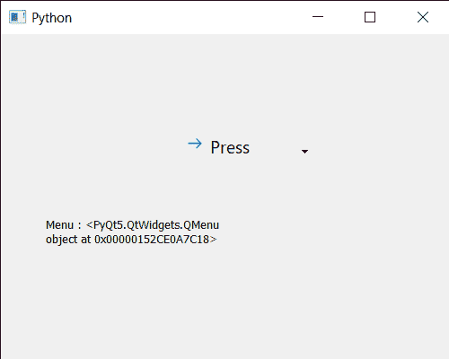

# PYqt5 Qcommand link button–获取菜单

> 原文:[https://www . geesforgeks . org/pyqt5-qcommandlink button-get-menu-of-it/](https://www.geeksforgeeks.org/pyqt5-qcommandlinkbutton-getting-menu-of-it/)

在本文中，我们将看到如何获得 QCommandLinkButton 的菜单。菜单基本上是命令链接按钮的一个额外功能，它允许它有一个下拉菜单，用户可以点击菜单项。我们可以借助`setMenu`方法将菜单设置为命令链接按钮，下面是命令链接按钮的样子


为此，我们对命令链接按钮对象使用`menu`方法

> **语法:**按钮.菜单()
> 
> **论证:**不需要论证
> 
> **返回:**返回 QMenu 对象

下面是实现

```py
# importing libraries
from PyQt5.QtWidgets import * 
from PyQt5 import QtCore, QtGui
from PyQt5.QtGui import * 
from PyQt5.QtCore import * 
import sys

class Window(QMainWindow):

    def __init__(self):
        super().__init__()

        # setting title
        self.setWindowTitle("Python ")

        # setting geometry
        self.setGeometry(100, 100, 500, 400)

        # calling method
        self.UiComponents()

        # showing all the widgets
        self.show()

    # method for components
    def UiComponents(self):

        # creating a command link button
        cl_button = QCommandLinkButton("Press", self)

        # setting geometry
        cl_button.setGeometry(200, 100, 150, 60)

        # QActions
        a = QAction("Next Geeks", self)
        b = QAction("Previous Geeks", self)

        # QMenu
        menu = QMenu()

        # adding actions to menu
        menu.addAction(a)
        menu.addAction(b)

        # setting menu to the button
        cl_button.setMenu(menu)

        # creating label
        label = QLabel("GeeksforGeeks", self)

        # setting label geometry
        label.setGeometry(50, 200, 200, 40)

        # making label multiline
        label.setWordWrap(True)

        # getting menu
        value = cl_button.menu()

        # setting text to the label
        label.setText("Menu : " + str(value))

# create pyqt5 app
App = QApplication(sys.argv)

# create the instance of our Window
window = Window()

# start the app
sys.exit(App.exec())
```

**输出:**
