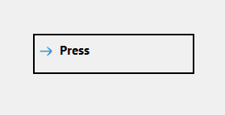
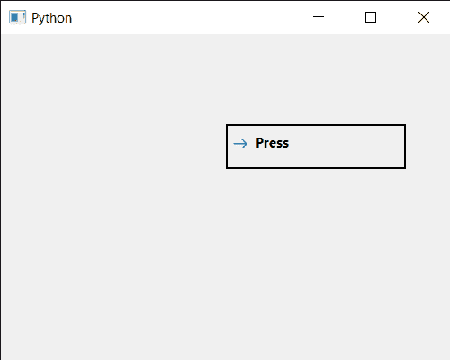

# PyQt5 qcommandlink button–为其设置边框

> 原文:[https://www . geeksforgeeks . org/pyqt5-qcommandlink button-setting-border-to-it/](https://www.geeksforgeeks.org/pyqt5-qcommandlinkbutton-setting-border-to-it/)

在本文中，我们将看到如何与 QCommandLinkButton 接壤。命令链接按钮是一种特殊类型的按钮，它兼具按钮和单选按钮的特性。默认情况下，命令链接按钮没有额外的边框，尽管当它被按下时，我们可以看到边框，我们也可以为它设置自定义边框。以下是自定义边框的外观


为了做到这一点，我们将为它设置样式表代码，我们使用`setStyleSheet`方法和命令链接按钮对象，下面是样式表代码

```
QCommandLinkButton
{
border : 2px solid black;
}

```

下面是实现

```
# importing libraries
from PyQt5.QtWidgets import * 
from PyQt5 import QtCore, QtGui
from PyQt5.QtGui import * 
from PyQt5.QtCore import * 
import sys

class Window(QMainWindow):

    def __init__(self):
        super().__init__()

        # setting title
        self.setWindowTitle("Python ")

        # setting geometry
        self.setGeometry(100, 100, 500, 400)

        # calling method
        self.UiComponents()

        # showing all the widgets
        self.show()

    # method for components
    def UiComponents(self):

        # creating a command link button
        cl_button = QCommandLinkButton("Press", self)

        # setting geometry
        cl_button.setGeometry(250, 100, 200, 50)

        # setting style sheet
        # setting border to it
        cl_button.setStyleSheet("QCommandLinkButton"
                                "{"
                                "border : 2px solid black;"
                                "}")

# create pyqt5 app
App = QApplication(sys.argv)

# create the instance of our Window
window = Window()

# start the app
sys.exit(App.exec())
```

**输出:**
