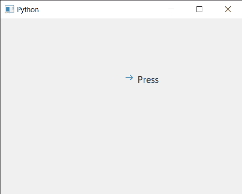

# PyQt5 qcommandlink button–设置帮助文本

> 原文:[https://www . geeksforgeeks . org/pyqt 5-qcommandlink button-setting-help-text/](https://www.geeksforgeeks.org/pyqt5-qcommandlinkbutton-setting-help-text/)

在本文中，我们将看到如何设置 QCommandLinkButton 的帮助文本。帮助文本是用于告诉其他用户有关命令链接按钮的使用信息的文本。它包含可用于检查用途、限制等的信息。

为此，我们对命令链接按钮对象使用`setWhatsThis`方法

> **语法:**按钮。设置什么(文本)
> 
> **自变量:**以字符串为自变量
> 
> **返回:**不返回

下面是实现

```py
# importing libraries
from PyQt5.QtWidgets import * 
from PyQt5 import QtCore, QtGui
from PyQt5.QtGui import * 
from PyQt5.QtCore import * 
import sys

class Window(QMainWindow):

    def __init__(self):
        super().__init__()

        # setting title
        self.setWindowTitle("Python ")

        # setting geometry
        self.setGeometry(100, 100, 500, 400)

        # calling method
        self.UiComponents()

        # showing all the widgets
        self.show()

    # method for components
    def UiComponents(self):

        # creating a command link button
        cl_button = QCommandLinkButton("Press", self)

        # setting geometry
        cl_button.setGeometry(250, 100, 200, 50)

        # setting help text
        cl_button.setWhatsThis("Command Link Button for GeeksforGeeks")

# create pyqt5 app
App = QApplication(sys.argv)

# create the instance of our Window
window = Window()

# start the app
sys.exit(App.exec())
```

**输出:**
