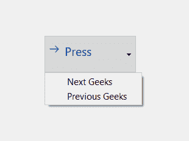
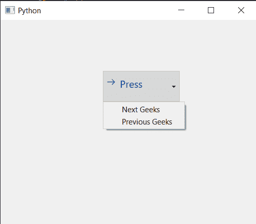

# PYqt5 Qcommand link button–设置菜单到它

> 原文:[https://www . geeksforgeeks . org/pyqt 5-qcommandlink button-setting-menu-to-it/](https://www.geeksforgeeks.org/pyqt5-qcommandlinkbutton-setting-menu-to-it/)

在本文中，我们将看到如何将菜单设置为 QCommandLinkButton。菜单基本上是命令链接按钮的一个额外功能，它允许它有一个下拉菜单，用户可以点击菜单项。下面是命令链接按钮的外观



为此，我们对命令链接按钮对象使用`setMenu`方法

> **语法:** button.setMenu(菜单)
> 
> **自变量:**它以 QMenu 对象为自变量
> 
> **返回:**不返回

下面是实现

```
# importing libraries
from PyQt5.QtWidgets import * 
from PyQt5 import QtCore, QtGui
from PyQt5.QtGui import * 
from PyQt5.QtCore import * 
import sys

class Window(QMainWindow):

    def __init__(self):
        super().__init__()

        # setting title
        self.setWindowTitle("Python ")

        # setting geometry
        self.setGeometry(100, 100, 500, 400)

        # calling method
        self.UiComponents()

        # showing all the widgets
        self.show()

    # method for components
    def UiComponents(self):

        # creating a command link button
        cl_button = QCommandLinkButton("Press", self)

        # setting geometry
        cl_button.setGeometry(200, 100, 150, 60)

        # QActions
        a = QAction("Next Geeks", self)
        b = QAction("Previous Geeks", self)

        # QMenu
        menu = QMenu()

        # adding actions to menu
        menu.addAction(a)
        menu.addAction(b)

        # setting menu to the button
        cl_button.setMenu(menu)

# create pyqt5 app
App = QApplication(sys.argv)

# create the instance of our Window
window = Window()

# start the app
sys.exit(App.exec())
```

**输出:**
