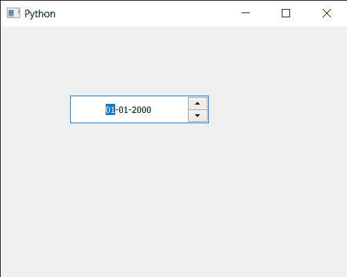

# pyqt 5 qdateedit–指定描述

> 原文:[https://www . geesforgeks . org/pyqt 5-qdate edit-assignment-description/](https://www.geeksforgeeks.org/pyqt5-qdateedit-assigning-description/)

在本文中，我们将看到如何为 QDateEdit 分配一个描述。Description 属性保存辅助技术看到的日期编辑的描述。日期编辑的可访问描述应该传达日期编辑的功能。虽然可访问的名称应该是一个简短的字符串(例如办公室日期)，但描述应该提供更多的上下文，例如保存所选日期。

为了做到这一点，我们对 QDateEdit 对象使用`setAccessibleDescription`方法

> **语法:**date . setaccessibledescription(文本)
> 
> **自变量:**以字符串为自变量
> 
> **返回:**返回无

下面是实现

```py
# importing libraries
from PyQt5.QtWidgets import * 
from PyQt5 import QtCore, QtGui
from PyQt5.QtGui import * 
from PyQt5.QtCore import * 
import sys

class Window(QMainWindow):

    def __init__(self):
        super().__init__()

        # setting title
        self.setWindowTitle("Python ")

        # setting geometry
        self.setGeometry(100, 100, 500, 400)

        # calling method
        self.UiComponents()

        # showing all the widgets
        self.show()

    # method for components
    def UiComponents(self):

        # creating a QDateEdit widget
        date = QDateEdit(self)

        # setting geometry of the date edit
        date.setGeometry(100, 100, 200, 40)

        # alignment
        a_flag = Qt.AlignCenter

        # setting alignment of date
        date.setAlignment(a_flag)

        # text
        text = "Allow user to set date"

        # setting description
        date.setAccessibleDescription(text)

# create pyqt5 app
App = QApplication(sys.argv)

# create the instance of our Window
window = Window()

# start the app
sys.exit(App.exec())
```

**输出:**
