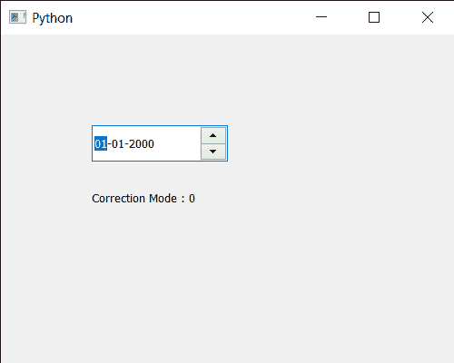

# pyqt 5 qdate edit–获取校正模式

> 原文:[https://www . geeksforgeeks . org/pyqt 5-qdate edit-get-correction-mode/](https://www.geeksforgeeks.org/pyqt5-qdateedit-getting-correction-mode/)

在本文中，我们将看到如何获得 QDateEdit 的校正模式。在日期编辑中，更正非常重要，这样用户就不能输入无效日期。例如，如果用户试图输入大于 12 的月份值，当前值将返回到以前的有效值。为了设置校正模式，我们使用`setCorrectionMode`方法，下面给出的日期编辑基本上有两种校正模式

`CorrectToPreviousValue`:日期编辑将恢复到最后一个有效值，其关联值为 0
`CorrectToNearestValue`:日期编辑将恢复到最近的有效值，其关联值为 1

为了做到这一点，我们对 QDateEdit 对象使用`correctionMode`方法

> **语法:** date.correctionMode()
> 
> **论证:**不需要论证
> 
> **返回:**它返回校正模式对象，但打印时显示与之相关的值

下面是实现

```
# importing libraries
from PyQt5.QtWidgets import * 
from PyQt5 import QtCore, QtGui
from PyQt5.QtGui import * 
from PyQt5.QtCore import * 
import sys

class Window(QMainWindow):

    def __init__(self):
        super().__init__()

        # setting title
        self.setWindowTitle("Python ")

        # setting geometry
        self.setGeometry(100, 100, 500, 400)

        # calling method
        self.UiComponents()

        # showing all the widgets
        self.show()

    # method for components
    def UiComponents(self):

        # creating a QDateEdit widget
        date = QDateEdit(self)

        # setting geometry of the date edit
        date.setGeometry(100, 100, 150, 40)

        # setting correction mode
        date.setCorrectionMode(0)

        # creating a label
        label = QLabel("GeeksforGeeks", self)

        # setting geometry
        label.setGeometry(100, 150, 200, 60)

        # making label multiline
        label.setWordWrap(True)

        # getting correction mode
        value = date.correctionMode()

        # setting text to the label
        label.setText("Correction Mode : " + str(value))

# create pyqt5 app
App = QApplication(sys.argv)

# create the instance of our Window
window = Window()

# start the app
sys.exit(App.exec())
```

**输出:**
