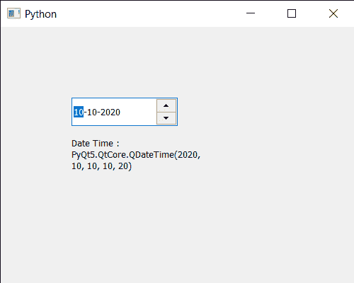

# pyqt 5 qdateedit–发布日期时间

> 原文:[https://www . geeksforgeeks . org/pyqt 5-qdate edit-get-date-time/](https://www.geeksforgeeks.org/pyqt5-qdateedit-getting-date-time/)

在本文中，我们将看到如何获取 QDateEdit 的日期时间。用户可以借助光标和键盘在日期编辑中设置日期，但有时需要通过编程设置初始日期或日期来显示记录中的日期，这可以借助`setDate`方法来完成。与正常日期不同，日期时间既有日期也有时间，尽管时间不会显示在日期编辑中。借助`setDate`方法，可以设置日期时间进行日期编辑。

为了做到这一点，我们对 QDateEdit 对象使用`dateTime`方法

> **语法:** date.dateTime()
> 
> **论证:**不需要论证
> 
> **返回:**返回 QDateTime 对象

下面是实现

```
# importing libraries
from PyQt5.QtWidgets import * 
from PyQt5 import QtCore, QtGui
from PyQt5.QtGui import * 
from PyQt5.QtCore import * 
import sys

class Window(QMainWindow):

    def __init__(self):
        super().__init__()

        # setting title
        self.setWindowTitle("Python ")

        # setting geometry
        self.setGeometry(100, 100, 500, 400)

        # calling method
        self.UiComponents()

        # showing all the widgets
        self.show()

    # method for components
    def UiComponents(self):

        # creating a QDateEdit widget
        date = QDateEdit(self)

        # setting geometry of the date edit
        date.setGeometry(100, 100, 150, 40)

        # date time
        d = QDateTime(2020, 10, 10, 10, 20)

        # setting date time
        date.setDateTime(d)

        # creating a label
        label = QLabel("GeeksforGeeks", self)

        # setting geometry
        label.setGeometry(100, 150, 200, 60)

        # making label multiline
        label.setWordWrap(True)

        # getting date time
        value = date.dateTime()

        # setting text to the label
        label.setText("Date Time : " + str(value))

# create pyqt5 app
App = QApplication(sys.argv)

# create the instance of our Window
window = Window()

# start the app
sys.exit(App.exec())
```

**输出:**
