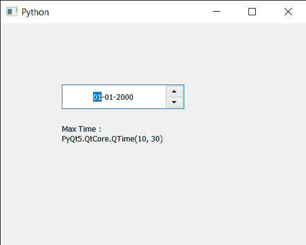

# PyQt5 qdate edit–获取可设置的最大时间

> 原文:[https://www . geeksforgeeks . org/pyqt 5-qdate edit-get-最大可设置时间/](https://www.geeksforgeeks.org/pyqt5-qdateedit-getting-maximum-time-which-can-be-set/)

在本文中，我们将了解如何获得最大的 QDateEdit 时间。有时需要设置最大时间，以便用户不能输入/存储超过最大时间的时间。我们可以借助`setTime`方法将时间设置为日期编辑。我们可以借助`setMaximumTime`方法设置最长时间。

为了做到这一点，我们对 QDateEdit 对象使用`maximumTime`方法

> **语法:**date . maximumime()
> 
> **论证:**不需要论证
> 
> **返回:**返回 QTime 对象

下面是实现

```py
# importing libraries
from PyQt5.QtWidgets import * 
from PyQt5 import QtCore, QtGui
from PyQt5.QtGui import * 
from PyQt5.QtCore import * 
import sys

class Window(QMainWindow):

    def __init__(self):
        super().__init__()

        # setting title
        self.setWindowTitle("Python ")

        # setting geometry
        self.setGeometry(100, 100, 500, 400)

        # calling method
        self.UiComponents()

        # showing all the widgets
        self.show()

    # method for components
    def UiComponents(self):

        # creating a QDateEdit widget
        date = QDateEdit(self)

        # setting geometry of the date edit
        date.setGeometry(100, 100, 200, 40)

        # alignment
        a_flag = Qt.AlignCenter

        # setting alignment of date
        date.setAlignment(a_flag)

        # QTime object
        t = QTime(10, 30)

        # setting maximum time
        date.setMaximumTime(t)

        # creating a label
        label = QLabel("GeeksforGeeks", self)

        # setting geometry
        label.setGeometry(100, 150, 200, 60)

        # making label multiline
        label.setWordWrap(True)

        # getting maximum time
        value = date.maximumTime()

        # setting text to the label
        label.setText("Max Time : " + str(value))

# create pyqt5 app
App = QApplication(sys.argv)

# create the instance of our Window
window = Window()

# start the app
sys.exit(App.exec())
```

**输出:**
