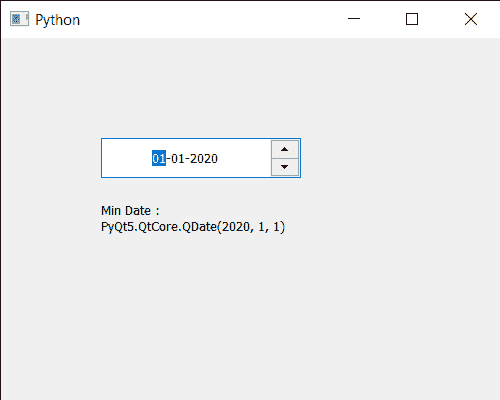

# PyQt5 qdate edit–获取用户可以输入的最小日期

> 原文:[https://www . geeksforgeeks . org/pyqt 5-qdate edit-get-最小日期-用户可以输入的日期/](https://www.geeksforgeeks.org/pyqt5-qdateedit-getting-minimum-date-which-user-can-enter/)

在本文中，我们将看到如何设置 QDateEdit 的最小日期。有时需要设置最小日期，这样用户就不能输入超出最小日期日期。例如，当要求用户输入酒店预订日期时，不允许用户输入过去的日期，这时就需要设置最小日期。可以借助`setMinimumDate`方法设置最小日期。

为了做到这一点，我们对 QDateEdit 对象使用`minimumDate`方法

> **语法:** date.minimumDate()
> 
> **论证:**不需要论证
> 
> **返回:**返回 QDate 对象

下面是实现

```py
# importing libraries
from PyQt5.QtWidgets import * 
from PyQt5 import QtCore, QtGui
from PyQt5.QtGui import * 
from PyQt5.QtCore import * 
import sys

class Window(QMainWindow):

    def __init__(self):
        super().__init__()

        # setting title
        self.setWindowTitle("Python ")

        # setting geometry
        self.setGeometry(100, 100, 500, 400)

        # calling method
        self.UiComponents()

        # showing all the widgets
        self.show()

    # method for components
    def UiComponents(self):

        # creating a QDateEdit widget
        date = QDateEdit(self)

        # setting geometry of the date edit
        date.setGeometry(100, 100, 200, 40)

        # alignment
        a_flag = Qt.AlignCenter

        # setting alignment of date
        date.setAlignment(a_flag)

        # QDate object
        d = QDate(2020, 1, 1)

        # setting minimum date
        date.setMinimumDate(d)

        # text
        text = "Geek date edit"

        # setting name
        date.setAccessibleName(text)

        # creating a label
        label = QLabel("GeeksforGeeks", self)

        # setting geometry
        label.setGeometry(100, 150, 200, 60)

        # making label multiline
        label.setWordWrap(True)

        # getting minimum date
        value = date.minimumDate()

        # setting text to the label
        label.setText("Min Date : " + str(value))

# create pyqt5 app
App = QApplication(sys.argv)

# create the instance of our Window
window = Window()

# start the app
sys.exit(App.exec())
```

**输出:**
