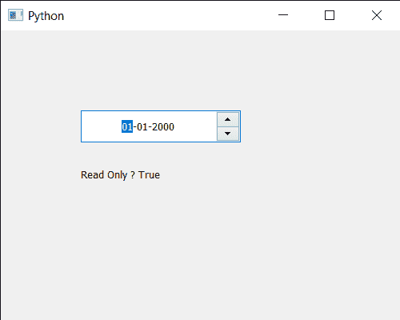

# PyQt5 QDateedit–获取只读属性

> 原文:[https://www . geesforgeks . org/pyqt 5-qdatedit-get-只读-property/](https://www.geeksforgeeks.org/pyqt5-qdateedit-getting-read-only-property/)

在本文中，我们将看到如何获得日期编辑的只读属性。默认情况下，当我们创建日期编辑时，它是可编辑的，尽管我们可以将其设为只读。在只读模式下，用户仍然可以将文本复制到剪贴板，或者拖放文本，但不能编辑它。为了使日期编辑只读，我们使用`setReadOnly`方法。

为了做到这一点，我们对 QDateEdit 对象使用`isReadOnly`方法

> **语法:** date.isReadOnly()
> 
> **论证:**不需要论证
> 
> **返回:**返回 bool

下面是实现

```
# importing libraries
from PyQt5.QtWidgets import * 
from PyQt5 import QtCore, QtGui
from PyQt5.QtGui import * 
from PyQt5.QtCore import * 
import sys

class Window(QMainWindow):

    def __init__(self):
        super().__init__()

        # setting title
        self.setWindowTitle("Python ")

        # setting geometry
        self.setGeometry(100, 100, 500, 400)

        # calling method
        self.UiComponents()

        # showing all the widgets
        self.show()

    # method for components
    def UiComponents(self):

        # creating a QDateEdit widget
        date = QDateEdit(self)

        # setting geometry of the date edit
        date.setGeometry(100, 100, 200, 40)

        # alignment
        a_flag = Qt.AlignCenter

        # setting alignment of date
        date.setAlignment(a_flag)

        # making date edit read only
        date.setReadOnly(True)

        # creating a label
        label = QLabel("GeeksforGeeks", self)

        # setting geometry
        label.setGeometry(100, 150, 250, 60)

        # making label multiline
        label.setWordWrap(True)

        # getting read-only property
        value = date.isReadOnly()

        # setting text to the label
        label.setText("Read Only ? " + str(value))

# create pyqt5 app
App = QApplication(sys.argv)

# create the instance of our Window
window = Window()

# start the app
sys.exit(App.exec())
```

**输出:**
