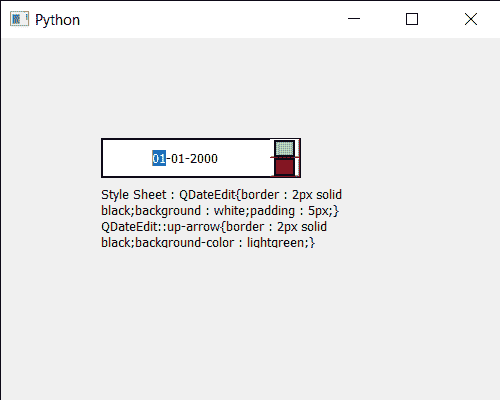

# PyQt5 QDateedit–获取样式表

> 原文:[https://www . geeksforgeeks . org/pyqt 5-qdateedit-get-style-sheet/](https://www.geeksforgeeks.org/pyqt5-qdateedit-getting-style-sheet/)

在本文中，我们将看到如何让样式表进行日期编辑。设置样式表使日期编辑看起来很独特在样式表的帮助下，我们可以为日期编辑设置颜色、边框和许多其他东西。我们可以借助`setStyleSheet`方法设置样式表。

为了做到这一点，我们对 QDateEdit 对象使用`styleSheet`方法

> **语法:**日期.样式表()
> 
> **论证:**不需要论证
> 
> **返回:**返回字符串

下面是实现

```py
# importing libraries
from PyQt5.QtWidgets import * 
from PyQt5 import QtCore, QtGui
from PyQt5.QtGui import * 
from PyQt5.QtCore import * 
import sys

class Window(QMainWindow):

    def __init__(self):
        super().__init__()

        # setting title
        self.setWindowTitle("Python ")

        # setting geometry
        self.setGeometry(100, 100, 500, 400)

        # calling method
        self.UiComponents()

        # showing all the widgets
        self.show()

    # method for components
    def UiComponents(self):

        # creating a QDateEdit widget
        date = QDateEdit(self)

        # setting geometry of the date edit
        date.setGeometry(100, 100, 200, 40)

        # alignment
        a_flag = Qt.AlignCenter

        # setting alignment of date
        date.setAlignment(a_flag)

        # setting style sheet
        date.setStyleSheet("QDateEdit"
                           "{"
                           "border : 2px solid black;"
                           "background : white;"
                           "padding : 5px;"
                           "}"
                           "QDateEdit::up-arrow"
                           "{"
                           "border : 2px solid black;"
                           "background-color : lightgreen;"
                           "}"
                           "QDateEdit::down-arrow"
                           "{"
                           "border : 2px solid black;"
                           "background-color : red;"
                           "}"
                           )

        # creating a label
        label = QLabel("GeeksforGeeks", self)

        # setting geometry
        label.setGeometry(100, 150, 250, 60)

        # making label multiline
        label.setWordWrap(True)

        # getting style sheet
        value = date.styleSheet()

        # setting text to the label
        label.setText("Style Sheet : " + str(value))

# create pyqt5 app
App = QApplication(sys.argv)

# create the instance of our Window
window = Window()

# start the app
sys.exit(App.exec())
```

**输出:**
