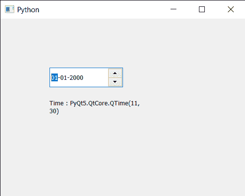

# PyQt5 qdate edit–获取时间

> 原文:[https://www.geeksforgeeks.org/pyqt5-qdateedit-getting-time/](https://www.geeksforgeeks.org/pyqt5-qdateedit-getting-time/)

在这篇文章中，我们将看到我们如何能够获得时间来进行 QDateEdit。与普通的类似日期不同，我们可以借助`setDate`方法为其设置日期时间。但是借助`setTime`方法，我们也可以只设置时间而不改变日期。

为了做到这一点，我们对 QDateEdit 对象使用`time`方法

> **语法:**日期.时间()
> 
> **论证:**不需要论证
> 
> **返回:**返回 QTime 对象

下面是实现

```
# importing libraries
from PyQt5.QtWidgets import * 
from PyQt5 import QtCore, QtGui
from PyQt5.QtGui import * 
from PyQt5.QtCore import * 
import sys

class Window(QMainWindow):

    def __init__(self):
        super().__init__()

        # setting title
        self.setWindowTitle("Python ")

        # setting geometry
        self.setGeometry(100, 100, 500, 400)

        # calling method
        self.UiComponents()

        # showing all the widgets
        self.show()

    # method for components
    def UiComponents(self):

        # creating a QDateEdit widget
        date = QDateEdit(self)

        # setting geometry of the date edit
        date.setGeometry(100, 100, 150, 40)

        # date time
        time = QTime(11, 30, 0)

        # setting time
        date.setTime(time)

        # creating a label
        label = QLabel("GeeksforGeeks", self)

        # setting geometry
        label.setGeometry(100, 150, 200, 60)

        # making label multiline
        label.setWordWrap(True)

        # getting time
        value = date.time()

        # setting text to the label
        label.setText("Time : " + str(value))

# create pyqt5 app
App = QApplication(sys.argv)

# create the instance of our Window
window = Window()

# start the app
sys.exit(App.exec())
```

**输出:**
