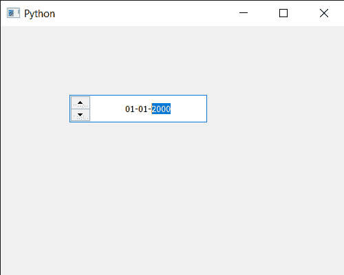

# PYqt5 QDateedit–向左箭头按钮

> 原文:[https://www . geesforgeks . org/pyqt 5-qdatedit-making-arrow-buttons-to-left-side/](https://www.geeksforgeeks.org/pyqt5-qdateedit-making-arrow-buttons-to-left-side/)

在本文中，我们将看到如何在日期编辑的左侧制作箭头按钮。默认情况下，当我们创建日期时，编辑箭头按钮位于右侧，尽管我们可以更改它，但通过更改布局方向是最简单的方法。

为了做到这一点，我们对 QDateEdit 对象使用`setLayoutDirection`方法

> **语法:** date.setLayoutDirection(Qt。RightToLeft)
> 
> **自变量:**以方向对象为自变量
> 
> **返回:**返回无

下面是实现

```
# importing libraries
from PyQt5.QtWidgets import * 
from PyQt5 import QtCore, QtGui
from PyQt5.QtGui import * 
from PyQt5.QtCore import * 
import sys

class Window(QMainWindow):

    def __init__(self):
        super().__init__()

        # setting title
        self.setWindowTitle("Python ")

        # setting geometry
        self.setGeometry(100, 100, 500, 400)

        # calling method
        self.UiComponents()

        # showing all the widgets
        self.show()

    # method for components
    def UiComponents(self):

        # creating a QDateEdit widget
        date = QDateEdit(self)

        # setting geometry of the date edit
        date.setGeometry(100, 100, 200, 40)

        # alignment
        a_flag = Qt.AlignCenter

        # setting alignment of date
        date.setAlignment(a_flag)

        # setting layout direction
        date.setLayoutDirection(Qt.RightToLeft)

# create pyqt5 app
App = QApplication(sys.argv)

# create the instance of our Window
window = Window()

# start the app
sys.exit(App.exec())
```

**输出:**
