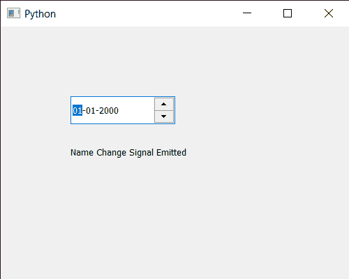

# pyqt 5 qdateedit–名称变更信号

> 哎哎哎:# t0]https://www . geeksforgeeks . org/pyqt 5-qdateedit-name-change signal/

在本文中，我们将看到如何获得 QDateEdit 的名称更改信号。Name 基本上用于在窗口中查找小部件，也用于样式表来编辑给定名称小部件的样式表。该信号在对象名称更改后发出。

**注意:**这是私人信号。它可以用于信号连接，但不能由用户发出。

为了做到这一点，我们对 QDateEdit 对象使用`objectNameChanged`方法

> **语法:**date . object name changed . connect(方法)
> 
> **自变量:**以方法为自变量
> 
> **返回:**返回无

下面是实现

```
# importing libraries
from PyQt5.QtWidgets import * 
from PyQt5 import QtCore, QtGui
from PyQt5.QtGui import * 
from PyQt5.QtCore import * 
import sys

class Window(QMainWindow):

    def __init__(self):
        super().__init__()

        # setting title
        self.setWindowTitle("Python ")

        # setting geometry
        self.setGeometry(100, 100, 500, 400)

        # calling method
        self.UiComponents()

        # showing all the widgets
        self.show()

    # method for components
    def UiComponents(self):

        # creating a QDateEdit widget
        date = QDateEdit(self)

        # setting geometry of the date edit
        date.setGeometry(100, 100, 150, 40)

        # creating a label
        label = QLabel("GeeksforGeeks", self)

        # setting geometry
        label.setGeometry(100, 150, 200, 60)

        # making label multiline
        label.setWordWrap(True)

        # getting name change signal
        date.objectNameChanged.connect(lambda: date_method())

        # method called by date edit
        def date_method():

            # setting text to the label
            label.setText("Name Change Signal Emitted")

        # setting name to the dat edit
        date.setObjectName("Geeks")

# create pyqt5 app
App = QApplication(sys.argv)

# create the instance of our Window
window = Window()

# start the app
sys.exit(App.exec())
```

**输出:**
