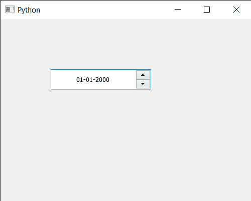

# PyQt5 日期编辑–设置日期对齐

> 原文:[https://www . geeksforgeeks . org/pyqt 5-qdate edit-setting-date-alignment/](https://www.geeksforgeeks.org/pyqt5-qdateedit-setting-date-alignment/)

在本文中，我们将看到如何设置 QDateEdit 的日期对齐。默认情况下，文本在左侧对齐，尽管通过更改对齐方式，我们可以使日期出现在中间。更改对齐方式不会影响日期编辑的功能。

为了做到这一点，我们对 QDateEdit 对象使用`setAlignment`方法

> **语法:** date.setAlignment(a_flag)
> 
> **参数:**以对齐标志为参数
> 
> **返回:**返回无

下面是实现

```
# importing libraries
from PyQt5.QtWidgets import * 
from PyQt5 import QtCore, QtGui
from PyQt5.QtGui import * 
from PyQt5.QtCore import *
import sys

class Window(QMainWindow):

    def __init__(self):
        super().__init__()

        # setting title
        self.setWindowTitle("Python ")

        # setting geometry
        self.setGeometry(100, 100, 500, 400)

        # calling method
        self.UiComponents()

        # showing all the widgets
        self.show()

    # method for components
    def UiComponents(self):

        # creating a QDateEdit widget
        date = QDateEdit(self)

        # setting geometry of the date edit
        date.setGeometry(100, 100, 200, 40)

        # alignment
        a_flag = Qt.AlignCenter

        # setting alignment of date
        date.setAlignment(a_flag)

# create pyqt5 app
App = QApplication(sys.argv)

# create the instance of our Window
window = Window()

# start the app
sys.exit(App.exec())
```

**输出:**
