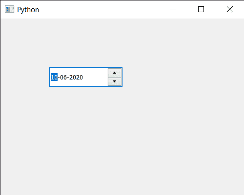

# PyQt5 日期编辑–以编程方式设置日期

> 原文:[https://www . geeksforgeeks . org/pyqt 5-qdate edit-setting-date-programmable/](https://www.geeksforgeeks.org/pyqt5-qdateedit-setting-date-programmatically/)

在本文中，我们将看到如何以编程方式向 QDateEdit 添加日期。用户可以在光标和键盘的帮助下将日期设置为日期编辑，但是有时需要以编程方式设置初始日期或日期，以便在记录中显示日期。
为了做到这一点，我们对 QDateEdit 对象使用 setDate 方法

> **语法:** date.setDate(d)
> **参数:**它以 QDate 对象为参数
> **返回:**它不返回

下面是实现

## 蟒蛇 3

```py
# importing libraries
from PyQt5.QtWidgets import *
from PyQt5 import QtCore, QtGui
from PyQt5.QtGui import *
from PyQt5.QtCore import *
import sys

class Window(QMainWindow):

    def __init__(self):
        super().__init__()

        # setting title
        self.setWindowTitle("Python ")

        # setting geometry
        self.setGeometry(100, 100, 500, 400)

        # calling method
        self.UiComponents()

        # showing all the widgets
        self.show()

    # method for components
    def UiComponents(self):

        # creating a QDateEdit widget
        date = QDateEdit(self)

        # setting geometry of the date edit
        date.setGeometry(100, 100, 150, 40)

        # date
        d = QDate(2020, 6, 10)

        # setting date to the date edit
        date.setDate(d)

# create pyqt5 app
App = QApplication(sys.argv)

# create the instance of our Window
window = Window()

# start the app
sys.exit(App.exec())
```

**输出:**

