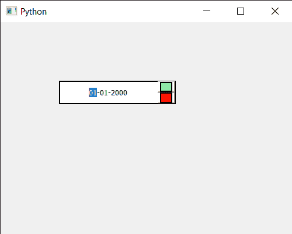

# PyQt5 QDateedit–设置样式表

> 原文:[https://www . geesforgeks . org/pyqt 5-qdatedit-setting-style-sheet/](https://www.geeksforgeeks.org/pyqt5-qdateedit-setting-style-sheet/)

在本文中，我们将看到如何将样式表设置为日期编辑。设置样式表使日期编辑看起来很独特在样式表的帮助下，我们可以为日期编辑设置颜色、边框和许多其他东西。

为了做到这一点，我们对 QDateEdit 对象使用`setStyleSheet`方法

> **语法:**date . set 样式表(代码)
> 
> **自变量:**以字符串为自变量
> 
> **返回:**返回无

下面是示例样式表代码

```py
QDateEdit
{
border : 2px solid black;
background-color : white;
padding : 5px;
}
QDateEdit::up-arraow
{
border : 2px solid black;
background-color : lightgreen;

}
QDateEdit::down-arrow
{
border : 2px solid black;
background-color : red;
}

```

下面是实现

```py
# importing libraries
from PyQt5.QtWidgets import * 
from PyQt5 import QtCore, QtGui
from PyQt5.QtGui import * 
from PyQt5.QtCore import * 
import sys

class Window(QMainWindow):

    def __init__(self):
        super().__init__()

        # setting title
        self.setWindowTitle("Python ")

        # setting geometry
        self.setGeometry(100, 100, 500, 400)

        # calling method
        self.UiComponents()

        # showing all the widgets
        self.show()

    # method for components
    def UiComponents(self):

        # creating a QDateEdit widget
        date = QDateEdit(self)

        # setting geometry of the date edit
        date.setGeometry(100, 100, 200, 40)

        # alignment
        a_flag = Qt.AlignCenter

        # setting alignment of date
        date.setAlignment(a_flag)

        # setting style sheet
        date.setStyleSheet("QDateEdit"
                           "{"
                           "border : 2px solid black;"
                           "background : white;"
                           "padding : 5px;"
                           "}"
                           "QDateEdit::up-arrow"
                           "{"
                           "border : 2px solid black;"
                           "background-color : lightgreen;"
                           "}"
                           "QDateEdit::down-arrow"
                           "{"
                           "border : 2px solid black;"
                           "background-color : red;"
                           "}"
                           )

# create pyqt5 app
App = QApplication(sys.argv)

# create the instance of our Window
window = Window()

# start the app
sys.exit(App.exec())
```

**输出:**
